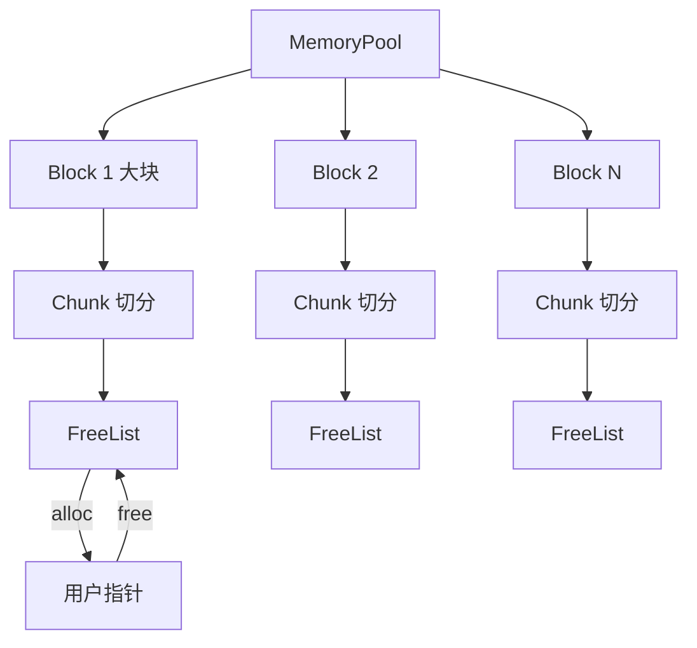
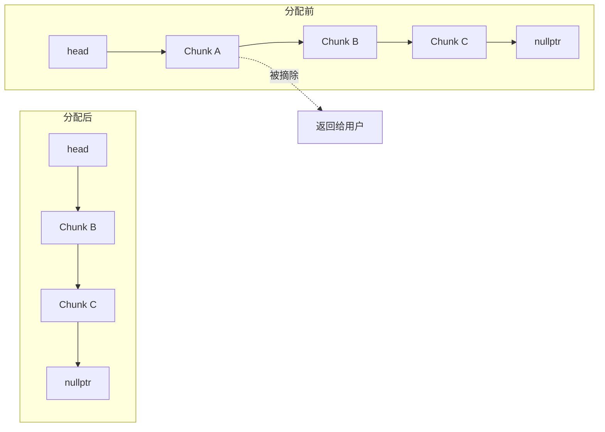
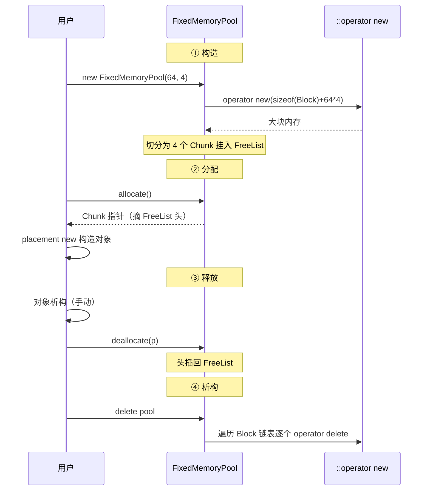
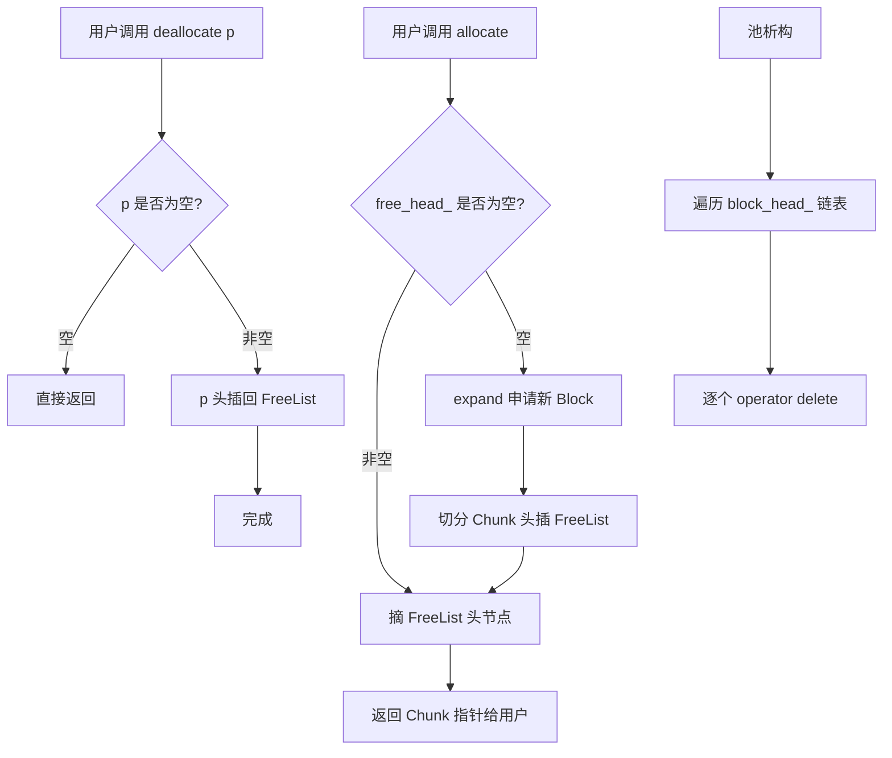

# 1. 背景与动机

## 1.1 频繁 `malloc`/`new` 的代价

直接使用 `malloc` / `new` 进行堆内存分配，存在多重隐藏开销：

| 开销来源 | 说明 | 量级 |
|---|---|---|
| **系统调用** | 当 ptmalloc/tcmalloc 内部无合适块时，需通过 `brk`/`mmap` 向 OS 申请 | 微秒级 |
| **堆元数据维护** | 分配器需维护 chunk header、空闲链表、bins 等 | 纳秒级 |
| **锁竞争** | 多线程下全局堆锁成为瓶颈 | 严重退化 |
| **内存碎片** | 频繁分配/释放产生外部碎片，导致 RSS 持续增长 | 长期累积 |
| **Cache Miss** | 分配出的地址不连续，破坏空间局部性 | 数十纳秒 |

> [!warning]
> 在游戏循环、高频交易、网络服务器等场景下，每帧/每请求可能进行数千次小对象分配，`malloc` 的开销会被放大成性能瓶颈。

## 1.2 内存池的核心思想

> **预分配一大块连续内存，由用户空间自行管理分配/回收，彻底绕过系统堆。**

核心收益：

- **O(1) 分配/释放**：通过空闲链表直接摘取/归还节点
- **零系统调用**：池子初始化时一次性向 OS 申请，运行期不再陷入内核
- **零碎片（定长池）**：所有块大小一致，不存在外部碎片
- **Cache 友好**：连续内存布局，提升命中率
- **可控生命周期**：池销毁时统一回收，避免泄漏

## 1.3 适用场景

| 场景 | 说明 |
|---|---|
| **定长对象高频分配** | 如网络连接对象、定时器节点、AST 节点 |
| **实时系统** | 需要可预测的分配延迟，禁止系统调用抖动 |
| **嵌入式系统** | 无动态内存管理或需避免堆碎片 |
| **批量生命周期管理** | 一批对象同时创建、同时销毁 |

---

# 2. 核心概念

## 2.1 内存池定义

> **内存池（Memory Pool）**：程序启动时预申请一大块内存，后续所有分配/释放都在该块内部完成，由池自行管理空闲块的数据结构，完全绕开系统堆。

## 2.2 关键术语

| 术语 | 含义 |
|---|---|
| **Chunk（块）** | 池中最小分配单元，通常定长 |
| **Block（大块）/ Page（页）** | 向 OS 申请的连续大内存，内部切分为多个 Chunk |
| **FreeList（空闲链表）** | 维护可用 Chunk 的单链表，O(1) 摘取/归还 |
| **Slab** | 同类型对象的池化区域，源自 Solaris Slab 分配器 |
| **Padding（填充）** | 为对齐而补的字节 |

## 2.3 分类

| 类型 | 特点 | 适用 |
|---|---|---|
| **定长内存池** | 所有 Chunk 等长，FreeList O(1) | 同类型对象（连接、节点） |
| **变长内存池** | 支持任意 size，类似 mini-malloc | 通用场景 |
| **线程局部池** | 每线程独立池，无锁 | 高并发 |
| **对象池** | 池化构造/析构，不仅是内存 | 复用昂贵对象 |

---

# 3. 架构设计

## 3.1 整体架构



## 3.2 内存块布局

一个 Block 内部的物理布局：

```text
+--------------------------------------------------+
|  Block Header  |  Chunk0 | Chunk1 | Chunk2 | ... |
+--------------------------------------------------+
                  ↑        ↑        ↑
                  对齐到 alignment 的整数倍
```

每个 Chunk 在未分配时，**头部存储下一个空闲 Chunk 的指针**，复用内存：

```text
+-----------------------+
| next*  |  (未用空间)  |   ← 空闲态
+-----------------------+

+-----------------------+
| 用户数据 ...          |   ← 占用态
+-----------------------+
```

> [!tip]
> 巧妙点：FreeList 节点不需要额外内存，**复用 Chunk 自身的前 `sizeof(void*)` 字节**作为链表指针。

## 3.3 FreeList 工作机制



- **分配**：`head = head->next; return head_old;` —— O(1)
- **回收**：`p->next = head; head = p;` —— O(1)

---

# 4. 定长内存池（示例）

## 4.1 关键代码实现

> 最常见的内存池形态：一次申请一大块内存（Block），然后把它切成很多固定大小的小块（Chunk），所有 Chunk 用空闲链表（Free List）管理，分配和释放都只需要修改几个指针，因此时间复杂度都是 O(1)。

```cpp
#include <cstddef>
#include <cstdint>
#include <new>

class FixedMemoryPool {
private:
    static inline std::size_t align_upward(std::size_t size, std::size_t alignment) {
        return (size + alignment - 1) & ~(alignment - 1);
    }

    struct Chunk {
        Chunk* next;
    };

    struct Block {
        Block* next;
        // 后续紧跟 chunk 数据
    };

    std::size_t chunk_size_;  // 每个 Chunk 的大小（已对齐）
    Block*    block_head_;    // 所有 Block 的链表头
    Chunk*    free_head_;     // 直接指向 FreeList 里第一个真实的空闲 Chunk

    void expand(std::size_t count) {
        // Block 头部 + count * chunk_size
        std::size_t block_size = sizeof(Block) + chunk_size_ * count;
        Block* block = static_cast<Block*>(::operator new(block_size));
        block->next = block_head_;
        block_head_ = block;

        // 切分 Chunk 并挂到 FreeList
        char* base = reinterpret_cast<char*>(block) + sizeof(Block);
        for (std::size_t i = 0; i < count; ++i) {
            Chunk* c = reinterpret_cast<Chunk*>(base + i * chunk_size_);
            c->next = free_head_;
            free_head_ = c;
        }
    }

    // 禁止拷贝
    FixedMemoryPool(const FixedMemoryPool&) = delete;
    FixedMemoryPool& operator=(const FixedMemoryPool&) = delete;

public:
    /// @param chunk_size  单个块大小（会自动对齐）
    /// @param chunk_count 初始块数量
    FixedMemoryPool(std::size_t chunk_size, std::size_t chunk_count)
        : chunk_size_(align_upward(chunk_size, alignof(std::max_align_t))),
          block_head_(nullptr),
          free_head_(nullptr) {
        expand(chunk_count);
    }

    ~FixedMemoryPool() {
        Block* cur = block_head_;
        while (cur) {
            Block* next = cur->next;
            ::operator delete(cur);
            cur = next;
        }
    }

    /// O(1) 分配
    void* allocate() {
        if (!free_head_) expand(64);  // 按需扩容
        Chunk* c = free_head_;
        free_head_ = free_head_->next;
        return c;
    }

    /// O(1) 释放
    void deallocate(void* p) {
        if (!p) return;
        Chunk* c = static_cast<Chunk*>(p);
        c->next = free_head_;
        free_head_ = c;
    }
};
```

下面按**整体结构 → 数据结构 → 各函数实现 → 生命周期**的顺序逐层解析。

## 4.2 代码解析

### 4.2.1 整体结构：两条独立的链表

`FixedMemoryPool` 内部维护**两条相互独立的单链表**，分别服务于不同目标：

| 链表 | 节点 | 头指针 | 用途 |
|---|---|---|---|
| **Block 链表** | `Block`（大块内存头） | `block_head_` | 串联所有向 OS 申请的大块，供析构时统一释放 |
| **FreeList** | `Chunk`（空闲小块） | `free_head_` | 管理可用 Chunk，支撑 O(1) 分配/回收 |

二者只是恰好都采用单链表，**逻辑上互不依赖**：Block 链表关心“哪些大块归我所有”，FreeList 关心“哪些小块当前空闲”。

```text
block_head_                              free_head_
     │                                        │
     ▼                                        ▼
┌──────────────────────────────────┐     Chunk3 → Chunk2 → Chunk1 → Chunk0 → nullptr
│ Block │ Chunk0 │ Chunk1 │ ...    │     (每个 Chunk 复用自身前 sizeof(void*) 字节存 next)
└──────────────────────────────────┘
```

> [!info]
> Block 链表中每个 `Block` 头部紧跟着其所属的 Chunk 区域；而 FreeList 中的 `Chunk` 节点并非独立分配，而是复用这些 Chunk 空闲时的前几个字节。两条链表共享同一片物理内存，但组织方式不同。

### 4.2.2 数据结构：Block 与 Chunk

#### Block：大块内存的管理头

```cpp
struct Block {
    Block* next;   // 指向下一个 Block，组成释放链表
};
```

每个 `Block` 是一次 `::operator new` 申请到的连续大内存的**头部（Header）**，仅承载管理信息，不存放用户数据。当前实现中 Header 只有一个 `next` 指针，唯一作用是把所有大块串成链表，以便析构函数遍历释放。

```text
┌──────────┬──────────────────────────────────────────────┐
│ Header   │            可供用户使用的 Chunk 区域         │
│ (Block)  │  Chunk0 │ Chunk1 │ Chunk2 │ ...              │
└──────────┴──────────────────────────────────────────────┘
←属于内存池→ ←───────────────属于用户───────────────────→
```

> [!tip]
> 生产级分配器（glibc malloc、jemalloc）的 Header 通常还记录 `chunk_count`、`free_count`、`magic`、`block_size` 等元信息，用于调试、统计与越界检测。本实现为求简洁仅保留 `next`。

#### Chunk：空闲块的复用结构

```cpp
struct Chunk {
    Chunk* next;
};
```

> [!warning]
> `Chunk` **不是一种常驻对象**，而是“空闲块”的临时视图。它只定义了空闲态下前几个字节如何解释。

`Chunk` 结构的大小仅为 `sizeof(Chunk*)`（如 8 字节），但每个 Chunk 实际占用的空间是 `chunk_size_`（已对齐，如 64 字节）。同一片内存在两种状态下被不同地解释：

| 状态 | 前 `sizeof(void*)` 字节 | 其余空间 |
|---|---|---|
| **空闲态**（在 FreeList 中） | `Chunk::next`，指向下一个空闲块 | 未使用 |
| **占用态**（已分配给用户） | 用户对象数据（如 `Connection`） | 用户对象数据 |

```text
空闲态：  ┌─────────┬─────────────────────┐
          │  next   │      (未使用)       │
          └─────────┴─────────────────────┘

占用态：  ┌─────────────────────────────────┐
          │  用户对象 (placement new 构造)  │
          └─────────────────────────────────┘
```

`allocate()` 返回指针后，用户通过 placement new 在原位构造对象，`next` 字段被覆盖；`deallocate()` 时再通过 `reinterpret_cast<Chunk*>(p)` 把 `next` 写回，重新纳入 FreeList。**这种“复用 Chunk 自身空间存链表指针”的设计使 FreeList 节点零额外开销。**

### 4.2.3 `expand()`：申请大块并切分

`expand()` 是内存池与 OS 唯一的交互点，负责申请大块内存、切分为 Chunk 并挂入 FreeList。

```cpp
void expand(std::size_t count) {
    // 1. 计算所需字节：Block 头 + count 个 Chunk
    std::size_t block_size = sizeof(Block) + chunk_size_ * count;

    // 2. 向 OS 申请原始内存（不构造对象）
    Block* block = static_cast<Block*>(::operator new(block_size));

    // 3. 头插法插入 Block 链表
    block->next = block_head_;
    block_head_ = block;

    // 4. 定位 Chunk 区域起始地址
    char* base = reinterpret_cast<char*>(block) + sizeof(Block);

    // 5. 切分 Chunk 并头插法挂入 FreeList
    for (std::size_t i = 0; i < count; ++i) {
        Chunk* c = reinterpret_cast<Chunk*>(base + i * chunk_size_);
        c->next = free_head_;
        free_head_ = c;
    }
}
```

#### 步骤 1 — 计算容量

`block_size = sizeof(Block) + chunk_size_ * count`。以 `sizeof(Block)=8`、`chunk_size_=64`、`count=4` 为例，申请 `8 + 64×4 = 264` 字节的连续内存。

#### 步骤 2 — 申请原始内存

`::operator new` 仅分配字节、不调用任何构造函数；返回的内存前 `sizeof(Block)` 字节作为 Header，其余作为 Chunk 区域。`block` 存放的是这次申请到的**整块大内存的首地址**。

#### 步骤 3 — 挂入 Block 链表

采用头插法（`block->next = block_head_; block_head_ = block;`）。多次 `expand()` 申请的大块在物理上不一定连续，靠 `Block::next` 串联，析构时沿链表逐个 `operator delete`。

#### 步骤 4 — 定位 Chunk 起点

```cpp
char* base = reinterpret_cast<char*>(block) + sizeof(Block);
```

`base` 是 Chunk 区域的首地址，也就是跳过 `Block` 管理头之后的位置。

必须先转成 `char*`，因为指针加法的单位是“所指类型的大小”：

| 表达式 | 实际移动 |
|---|---|
| `block + 1` | `sizeof(Block)` 字节 |
| `reinterpret_cast<char*>(block) + 1` | 1 字节 |
| `void* + n` | 标准 C++ 不允许，`void` 没有大小 |

所以 `reinterpret_cast<char*>(block) + sizeof(Block)` 表示**从整块内存首地址向后移动 `sizeof(Block)` 个字节**。

```text
block
  |
  v
+----------------------+----------------------+----------------------+ ...
| Block header         | Chunk0               | Chunk1               |
| sizeof(Block) bytes  | chunk_size_ bytes    | chunk_size_ bytes    |
+----------------------+----------------------+----------------------+
                       ^
                       base
```

> [!note]
> 也可以写成这样：
>
> ```cpp
> char* base = reinterpret_cast<char*>(block + 1);
> ```

#### 步骤 5 — 切分并挂入 FreeList

```cpp
for (std::size_t i = 0; i < count; ++i) {
    Chunk* c = reinterpret_cast<Chunk*>(base + i * chunk_size_);
    c->next = free_head_;
    free_head_ = c;
}
```

`base + i * chunk_size_` 定位第 `i` 个 Chunk 的起始地址；`reinterpret_cast<Chunk*>` 表示“把这块空闲内存的开头解释成一个 `Chunk` 节点”。这里要区分两个位置：

```text
栈上的局部变量 c：保存当前 Chunk 的首地址

+----------------+
| 0x1048         |
+----------------+
       |
       v

内存池里的 Chunk：空闲态时，开头存 next 指针

0x1048
+----------------+-----------------------------+
| next = 0x1008  | 剩余空闲字节                |
+----------------+-----------------------------+
```

也就是说，`c` 自己只保存地址；`c->next` 等价于 `(*c).next`，写入的是 **`c` 指向的那块 Chunk 内存开头的指针字段**。

若 `base=0x1008`、`chunk_size_=64`、`count=4`，则地址切分如下：

| Chunk | 地址范围 |
|---|---|
| `Chunk0` | `0x1008 ~ 0x1047` |
| `Chunk1` | `0x1048 ~ 0x1087` |
| `Chunk2` | `0x1088 ~ 0x10C7` |
| `Chunk3` | `0x10C8 ~ 0x1107` |

每个空闲 Chunk 的开头存一个 `next` 指针：

```
Chunk0 @ 0x1008
+----------------------+-----------------------------+
| next 指针            | 剩余可用空间                |
| 8 bytes              | 56 bytes                    |
+----------------------+-----------------------------+
```

所以 `c->next = free_head_;` 的意思是**去 c 指向的那块内存里，把最前面的 sizeof(Chunk*) 字节写成 free_head_ 的值**，比如初始：

```
free_head_ = nullptr;
```

循环第 0 次：

```
c = Chunk0;
c->next = nullptr;
free_head_ = c;
```

布局：

```
free_head_
   ↓
Chunk0
+-------------+
| next = null |
+-------------+
```

循环第 1 次：

```
c = Chunk1;
c->next = free_head_; // 也就是 Chunk0
free_head_ = c;       // free_head_ 现在指向 Chunk1
```

布局：

```
free_head_
   ↓
Chunk1              Chunk0
+-------------+     +-------------+
| next -------|---> | next = null |
+-------------+     +-------------+
```

循环第 2 次后：

```
free_head_
   ↓
Chunk2              Chunk1              Chunk0
+-------------+     +-------------+     +-------------+
| next -------|---> | next -------|---> | next = null |
+-------------+     +-------------+     +-------------+
```

循环第 3 次后：

```
free_head_
   ↓
Chunk3              Chunk2              Chunk1              Chunk0
+-------------+     +-------------+     +-------------+     +-------------+
| next -------|---> | next -------|---> | next -------|---> | next = null |
+-------------+     +-------------+     +-------------+     +-------------+
```

所以这段代码是在把一整块连续内存，切成多个 Chunk，然后用每个 Chunk 自己开头的几个字节保存“下一个空闲 Chunk 的地址”，从而组成一个单链表。

> [!tip]
> `free_head_` 不是 dummy 头结点，它只是一个 `Chunk*` 头指针，直接保存第一个**真实空闲 Chunk 的地址**。

> [!warning]
> 本实现假设 `sizeof(Block)` 是 `alignof(std::max_align_t)` 的整数倍，从而 `base` 自然满足最大对齐要求。这在主流平台成立，但并非标准保证。更严谨的做法是对 `base` 显式做一次对齐，或令 `Block` 自身按 `std::max_align_t` 对齐（见 5.2.7）。

### 4.2.4 构造函数：初始化对齐与首批 Chunk

```cpp
FixedMemoryPool(std::size_t chunk_size, std::size_t chunk_count)
    : chunk_size_(align_upward(chunk_size, alignof(std::max_align_t))),
      block_head_(nullptr),
      free_head_(nullptr) {
    expand(chunk_count);
}
```

执行顺序：

1. **对齐 `chunk_size`**：`align_upward(chunk_size, alignof(std::max_align_t))` 将用户传入的 `chunk_size` 向上取整到 `max_align_t`（主流平台为 8 或 16）的整数倍。即使请求 7 字节，最终也按 8 字节分配，保证任意类型的对象都能安全 placement new 到 Chunk 内。
2. **置空头指针**：`block_head_` 与 `free_head_` 初始化为 `nullptr`。
3. **首批扩容**：调用 `expand(chunk_count)` 申请第一个大块并切分。这意味着**内存池在构造完成时即占用 `sizeof(Block) + chunk_size_ * chunk_count` 字节内存**——这是一种“预换时间”的取舍，换取后续分配的 O(1)。

### 4.2.5 `allocate()` / `deallocate()`

```cpp
void* allocate() {
    if (!free_head_) expand(64);  // 按需扩容
    Chunk* c = free_head_;
    free_head_ = free_head_->next;
    return c;
}

void deallocate(void* p) {
    if (!p) return;
    Chunk* c = static_cast<Chunk*>(p);
    c->next = free_head_;
    free_head_ = c;
}
```

#### `allocate()` — 摘头分配

```text
分配前：

free_head_
   |
   v
+------+      +------+      +------+      +------+
| C3   | ---> | C2   | ---> | C1   | ---> | C0   | ---> nullptr
+------+      +------+      +------+      +------+


c = free_head_;  // c 指向 C3

free_head_
   |
   v
+------+      +------+      +------+      +------+
| C3   | ---> | C2   | ---> | C1   | ---> | C0   | ---> nullptr
+------+      +------+      +------+      +------+
   ^
   |
   c


free_head_ = c->next;  // free_head_ 后移到 C2

c
|
v
+------+      +------+      +------+      +------+
| C3   | ---> | C2   | ---> | C1   | ---> | C0   | ---> nullptr
+------+      +------+      +------+      +------+
                ^
                |
            free_head_
   
return c;  // 把 C3 返回给用户

分配后：

free_head_
   |
   v
+------+      +------+      +------+
| C2   | ---> | C1   | ---> | C0   | ---> nullptr
+------+      +------+      +------+

用户拿到 C3 的指针
```

热路径只有 1 次判空和几次指针读写，不调用通用分配器；因此在 `free_head_` 非空时是 O(1)。当 `free_head_` 为空时会触发 `expand(64)`，这是冷路径，成本由后续多次分配分摊。

> [!question]
> 当用户调用 `allocate` 分配空闲 Chunk 时，假设 `chunk_size_ = 64`，用户实际能使用的大小是只有 `64 - sizeof(Chunk)` 吗？

不是。用户实际能使用的是 **整个 64 字节**，不是 `64 - sizeof(Chunk)`。

关键在于：`Chunk::next` 只在 **空闲态** 存在。当 Chunk 在 FreeList 里时，它的前 `sizeof(Chunk*)` 字节被内存池拿来存 `next`：

```
空闲态：

+----------------+------------------------+
| next 指针      | 未使用空间             |
| 8 bytes        | 56 bytes               |
+----------------+------------------------+
总大小：64 bytes
```

但是一旦 `allocate()` 把这个 Chunk 返回给用户：

```
Chunk* c = free_head_;
free_head_ = c->next;
return c;
```

这个 Chunk 就从 FreeList 摘下来了，**它不再需要保存 `next`**。此时这 64 字节全部交给用户使用：

```
占用态：

+-----------------------------------------+
| 用户数据，可用 64 bytes                 |
+-----------------------------------------+
总大小：64 bytes
```

也就是说，同一块内存有两种解释方式：

- **空闲时**：前 8 字节解释为 Chunk::next
- **占用时**：整块 64 字节解释为用户数据

所以如果你用 placement new 构造一个对象：

```
void* mem = pool.allocate();
T* obj = new (mem) T(...);
```

那么 `T` 最多可以占用 `chunk_size_` 字节，也就是 64 字节。不过有一个重要前提：

```cpp
chunk_size_ >= sizeof(Chunk)
```

否则空闲态时连 `next` 指针都放不下。更准确地说，构造池时应该保证：

```cpp
chunk_size_ = align_upward(
    std::max(requested_size, sizeof(Chunk)),
    alignof(std::max_align_t)
);
```

在原代码中只是：

```cpp
chunk_size_(align_upward(chunk_size, alignof(std::max_align_t)))
```

那在用户传入 `chunk_size < sizeof(Chunk)` 时是不够严谨的。比如用户传：

```
FixedMemoryPool pool(1, 128);
```

对齐到 8 后通常刚好够放一个指针；但如果某个平台 `sizeof(Chunk*) > alignof(std::max_align_t)`，或者对齐策略变了，就可能不安全。

#### `deallocate()` — 头插回收

```text
回收前：

free_head_
   |
   v
+------+      +------+      +------+
| C2   | ---> | C1   | ---> | C0   | ---> nullptr
+------+      +------+      +------+

用户持有 p，p 指向 C3：

p
|
v
+------+
| C3   |
+------+


c = static_cast<Chunk*>(p);  // 把 p 解释为 Chunk*，c 指向 C3

free_head_
   |
   v
+------+      +------+      +------+
| C2   | ---> | C1   | ---> | C0   | ---> nullptr
+------+      +------+      +------+

p
|
v
+------+
| C3   |
+------+
   ^
   |
   c


c->next = free_head_;  // C3->next = C2

c
|
v
+------+      +------+      +------+      +------+
| C3   | ---> | C2   | ---> | C1   | ---> | C0   | ---> nullptr
+------+      +------+      +------+      +------+
                ^
                |
            free_head_


free_head_ = c;  // free_head_ 重新指向 C3

free_head_
   |
   v
+------+      +------+      +------+      +------+
| C3   | ---> | C2   | ---> | C1   | ---> | C0   | ---> nullptr
+------+      +------+      +------+      +------+


回收后：

free_head_
   |
   v
+------+      +------+      +------+      +------+
| C3   | ---> | C2   | ---> | C1   | ---> | C0   | ---> nullptr
+------+      +------+      +------+      +------+
```

`static_cast<Chunk*>(p)` 的语义是“把 `void*` 恢复成对象指针类型”。这里合法的前提是：`p` 原本就是本池 `allocate()` 返回的 Chunk 地址，只是在接口边界上被隐式转成了 `void*`。

也可以写成 `reinterpret_cast<Chunk*>(p)`，通常也能工作，但语义更重，表示底层重解释。对于 `void* -> Chunk*` 这种恢复对象指针的场景，`static_cast` 更准确。

**注意**：虽然 C3 原来的 next 信息会丢失，但丢失没关系，因为分配时已经用 `free_head_` 接管了后续链表。回收后的 Chunk 重新成为 FreeList 的**头节点**，等待下次 `allocate()` 复用。整个回收同样是热路径 O(1)。

> [!warning]
> `deallocate(p)` **不检查 `p` 是否真属于本池**，也**不检查 `p` 是否已被释放过**（双重释放会形成自环导致死循环）。生产实现应加 magic 校验与 in-pool 检测。

### 4.2.6 析构函数：统一归还大块

```cpp
~FixedMemoryPool() {
    Block* cur = block_head_;
    while (cur) {
        Block* next = cur->next;
        ::operator delete(cur);
        cur = next;
    }
}
```

析构只遍历 **Block 链表**逐个 `operator delete`，**不碰 FreeList**。原因有二：

1. **Block 链表已覆盖所有申请的内存**：每个 Block 头部紧跟着其切分出的 Chunk 区域，释放 Block 即释放其下属的所有 Chunk。
2. **FreeList 中的 Chunk 都内嵌于某个 Block 内**，没有独立申请的内存，无需也不能单独释放。

> [!warning]
> 析构时**不会调用用户对象的析构函数**。用户必须先用 `p->~T()` 手动析构，再 `pool.deallocate(p)`，否则会资源泄漏（如对象内部持有 `std::string`、文件句柄等）。

### 4.2.7 对齐函数 `align_upward`

> [!abstract]
> 内存池的块大小、起始地址都需要对齐，否则会引发跨缓存行访问、平台总线错误等问题。

```cpp
/**
 * 将字节大小向上对齐到指定对齐数的整数倍。
 *
 * 例如：align_upward(13, 8) == 16，align_upward(8, 8) == 8
 *
 * @param size      需要对齐的原始字节大小
 * @param alignment 对齐基数，必须是 2 的幂次方（如 1、2、4、8、16...）
 * @return          大于等于 size、且是 alignment 整数倍的最小值
 */
static inline std::size_t align_upward(std::size_t size, std::size_t alignment) {
  return (size + alignment - 1) & ~(alignment - 1);
}
```

#### 公式拆解

> [!important]
> ```cpp
> (size + alignment - 1) & ~(alignment - 1)
> ```
> **前提**：`alignment` 必须是 2 的幂次方，且 `size + alignment - 1` 不能发生整数溢出。

数学目标是求“大于等于 `size` 的最小 `alignment` 倍数”：

$$
\text{aligned}=\left\lceil\frac{\text{size}}{\text{alignment}}\right\rceil \times \text{alignment}
$$

用整数除法可写成：

```cpp
((size + alignment - 1) / alignment) * alignment
```

当 `alignment` 是 2 的幂时，除法和乘法可以用位运算替代：

```cpp
(size + alignment - 1) & ~(alignment - 1)
```

以 `alignment = 8` 为例：

```text
8   → 0000 1000
7   → 0000 0111
~7  → 1111 1000
```

`& ~7` 会清零低 3 位，等价于向下取整到 8 的倍数。先加 `7` 再清低位，就得到向上对齐：

| `size` | `size + 7` | `(size + 7) & ~7` | 结果 |
|---|---|---|---|
| 7 | 14 | 8 | 向上到 8 |
| 8 | 15 | 8 | 已对齐，保持 8 |
| 13 | 20 | 16 | 向上到 16 |
| 16 | 23 | 16 | 已对齐，保持 16 |

> [!tip]
> 记忆技巧：**“+偏移推过去，&掩码拉回来”**。`+ alignment - 1` 让需要进位的值越过边界，`& ~(alignment - 1)` 再把低位清零。

### 4.2.8 完整生命周期

把前述函数串起来，一个内存池的完整生命周期如下：



#### 具体数值模拟

构造 `FixedMemoryPool(56, 4)`（请求 56 字节 Chunk，初始 4 块）：

1. **对齐**：`align_upward(56, 8) = 56`（已是 8 的倍数），`chunk_size_ = 56`。
2. **`expand(4)`**：申请 `8 + 56×4 = 232` 字节。
3. **切分**：`base = block + 8`，依次生成 `Chunk0@(base+0)`、`Chunk1@(base+56)`、`Chunk2@(base+112)`、`Chunk3@(base+168)`。
4. **挂入 FreeList**（头插）：`free_head_ → Chunk3 → Chunk2 → Chunk1 → Chunk0 → nullptr`。
5. **首次 `allocate()`**：返回 `Chunk3`，`free_head_ → Chunk2`。
6. **`deallocate(Chunk3)`**：`Chunk3->next = Chunk2`，`free_head_ → Chunk3 → Chunk2 → ...`。
7. **析构**：`operator delete(block)`，整块归还 OS。

> [!tip]
> 整个生命周期内，**与 OS 的交互只发生在构造和按需 `expand` 时**；常态化的分配/释放完全在用户态通过几条指针赋值完成，这正是内存池性能优势的根源。

## 4.3 使用示例

以管理 `Connection` 对象为例，展示内存池的典型用法：

```cpp
#include <new>
#include <cstring>

struct Connection {
    int  fd;
    char ip[16];
    Connection(int f, const char* s) : fd(f) { std::strcpy(ip, s); }
    ~Connection() { /* 关闭 fd 等 */ }
};

int main() {
    // 1. 构造池：Chunk 至少容纳 sizeof(Connection)，初始 128 块
    FixedMemoryPool pool(sizeof(Connection), 128);

    // 2. 分配 + placement new 构造
    void* mem = pool.allocate();
    Connection* conn = new (mem) Connection(3, "127.0.0.1");

    // ... 使用 conn ...

    // 3. 手动析构 + 回收
    conn->~Connection();
    pool.deallocate(conn);

    // 4. 池析构时统一归还所有 Block
}
```

> [!warning]
> 三步缺一不可：`allocate` 只给裸内存，必须 `placement new` 才构造对象；回收前必须手动 `~T()`，否则对象内部资源（`fd`、`std::string` 等）泄漏。

## 4.4 线程安全版

经典版未加锁，多线程并发 `allocate`/`deallocate` 会导致 FreeList 竞争（丢失更新、悬空指针）。最小改造是用互斥锁包裹核心路径：

```cpp
#include <mutex>

class ThreadSafePool {
private:
    FixedMemoryPool pool_;          // 复用经典实现
    std::mutex      mtx_;

public:
    ThreadSafePool(std::size_t chunk_size, std::size_t chunk_count)
        : pool_(chunk_size, chunk_count) {}

    void* allocate() {
        std::lock_guard<std::mutex> lk(mtx_);
        return pool_.allocate();
    }

    void deallocate(void* p) {
        std::lock_guard<std::mutex> lk(mtx_);
        pool_.deallocate(p);
    }
};
```

### 4.4.1 取舍

| 方案 | 吞吐 | 复杂度 | 适用场景 |
|---|---|---|---|
| **全局锁**（上图） | 低（竞争激烈） | 低 | 临界区短、线程数少 |
| **每线程独立池**（ThreadLocal） | 高（无锁） | 中 | 线程数固定、对象不跨线程 |
| **分段锁 / Sharded Pool** | 较高 | 高 | 高并发通用场景 |

> [!tip]
> FreeList 的摘头/头插本质是 LIFO 栈操作，天然适合无锁 CAS 实现（`std::atomic<Chunk*>`）。但 ABA 问题需用 tagged pointer 或 hazard pointer 解决，远超教学版范围。

---

# 5. 数据流



要点：

- **分配热路径**（`free_head_` 非空）：仅 2 次指针读写，无系统调用。
- **冷路径**（触发 `expand`）：偶发，分摊到后续多次分配后成本可忽略。
- **回收路径**：恒为 2 次指针读写，无任何分支调用 OS。

---

# 6. 性能分析

## 6.1 与 `malloc` 对比

| 维度 | `malloc/free` | 定长内存池 |
|---|---|---|
| 时间复杂度 | 平均 O(1)，最坏可达 O(n)（碎片整理/锁竞争） | **严格 O(1)** |
| 系统调用 | 频繁（堆扩展时 `brk/mmap`） | **仅构造/扩容时** |
| 内存碎片 | 高（外部 + 内部） | **零（定长）** |
| 多线程 | 全局堆锁或 arena 锁 | 可每线程一池，**无锁** |
| 缓存友好性 | 分散 | **连续布局，命中率高** |
| 灵活性 | 任意大小 | **仅固定大小** |

## 6.2 开销估算

设 `chunk_size_ = 64`，`count = 1024`：

- **内存开销**：`sizeof(Block) + 64×1024 ≈ 64 KB`（Block 头 8 字节可忽略）。
- **单次分配**：~2 条 mov 指令 + 1 条比较，纳秒级。
- **对比 `malloc(64)`**：glibc tcache 命中约 20–40 ns，未命中走 fastbin/smallbin 可达 100+ ns；池化版本稳定在个位数 ns。

## 6.3 适用边界

> [!warning]
> 内存池并非银弹。当对象**大小差异大**、**生命周期复杂**或**总用量小**时，池化的预分配与固定大小反而增加开销。最佳场景是**同型对象高频创建/销毁**（连接、节点、事件）。

---

# 7. 易错点

| # | 陷阱 | 后果 | 规避 |
|---|---|---|---|
| 1 | **双重释放**：同一指针 `deallocate` 两次 | FreeList 形成自环，`allocate` 死循环 | 加 magic/in-use 标志位校验 |
| 2 | **跨池释放**：把 A 池的指针还给 B 池 | 内存归属混乱、析构时双重释放 | 校验指针是否落在 `block_head_` 区间内 |
| 3 | **忘记手动析构**：`deallocate` 前 `~T()` | 对象内部资源泄漏 | 封装 `make<T>(args...)` / `destroy(p)` 接口 |
| 4 | **Chunk 过小**：`chunk_size < sizeof(T)` | placement new 越界写相邻 Chunk | 构造时断言 `chunk_size_ >= sizeof(T)` |
| 5 | **对齐不足**：`chunk_size` 非 `max_align_t` 倍数 | 平台相关崩溃或性能退化 | 构造时强制 `align_upward`（本实现已做） |
| 6 | **多线程未加锁**：直接用经典版 | FreeList 竞争，丢失更新/悬空 | 用 5.4 的线程安全版或 ThreadLocal 池 |
| 7 | **`sizeof(Block)` 未对齐**：`base` 错位 | 罕见平台崩溃 | 让 `Block` 继承 `std::max_align_t` 或显式对齐 `base` |

---

# 8. 最佳实践

1. **场景匹配**：仅对“同型、高频、生命周期短”的对象池化；其余仍用 `malloc`/`new`。
2. **封装 RAII**：提供 `pool.make<T>(args...)` 与 `pool.destroy(p)`，内部完成分配+构造 / 析构+回收，避免手动 placement new 漏写析构。
3. **对齐优先**：构造期一次性 `align_upward`，运行期不再处理；`chunk_size_` 取 `max(sizeof(T), alignof(T))` 向上对齐。
4. **按需扩容**：初始给合理批量（如 256），用尽时按 2× 或固定批次扩容，避免每对象一次 `expand`。
5. **线程模型**：优先 ThreadLocal 池（无锁、缓存友好）；跨线程传递对象时用“归还到原池”的 sharded 设计。
6. **统计与调试**：维护 `alloc_count`/`free_count`/`peak_usage`，加 magic 字段，便于排查泄漏与越界。
7. **析构兜底**：池析构前断言 `alloc_count == free_count`，提示用户未归还的对象。

---

# 9. 总结


- 内存池用**预分配 + FreeList**把分配/释放降到 O(1)，本质是用空间换时间、用固定大小换零碎片。
- **Block 链表**管“哪些大块归我”（析构归还），**FreeList** 管“哪些小块空闲”（O(1) 调度），两者共享物理内存、逻辑独立。
- **Chunk 复用自身前几个字节存 `next`**，使 FreeList 节点零额外开销——这是教学版最巧妙之处。
- 生产化需补齐**对齐校验、双重释放检测、线程安全、RAII 封装、统计调试**等工程护栏。

> [!note]
> 进一步学习：可阅读 SGI STL 的 `__default_alloc_template`（带 free list 的二级配置器）、boost::pool、jemalloc 的 tcache 设计。