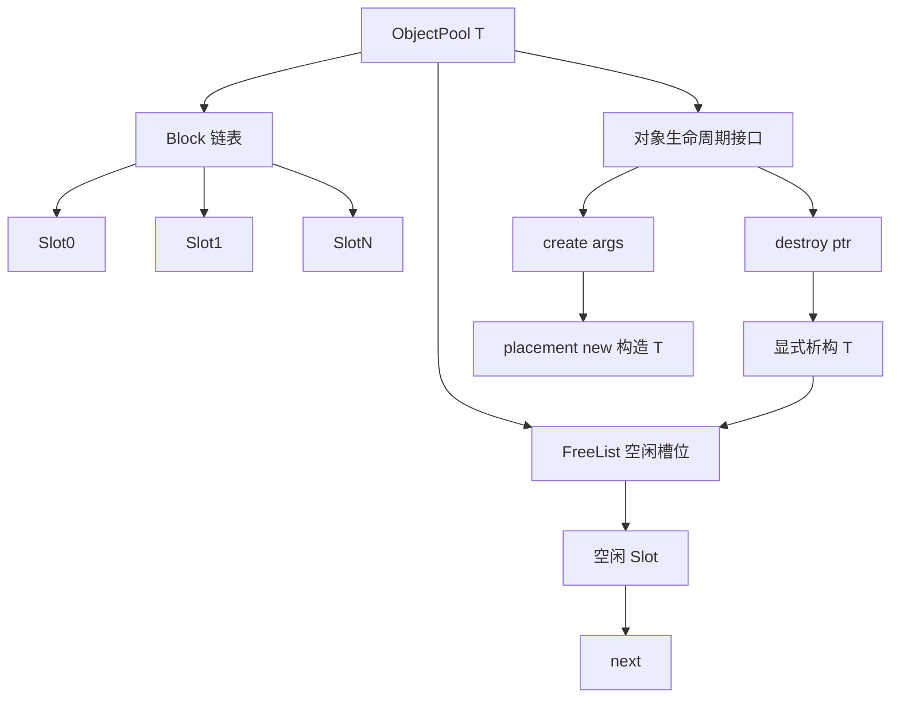
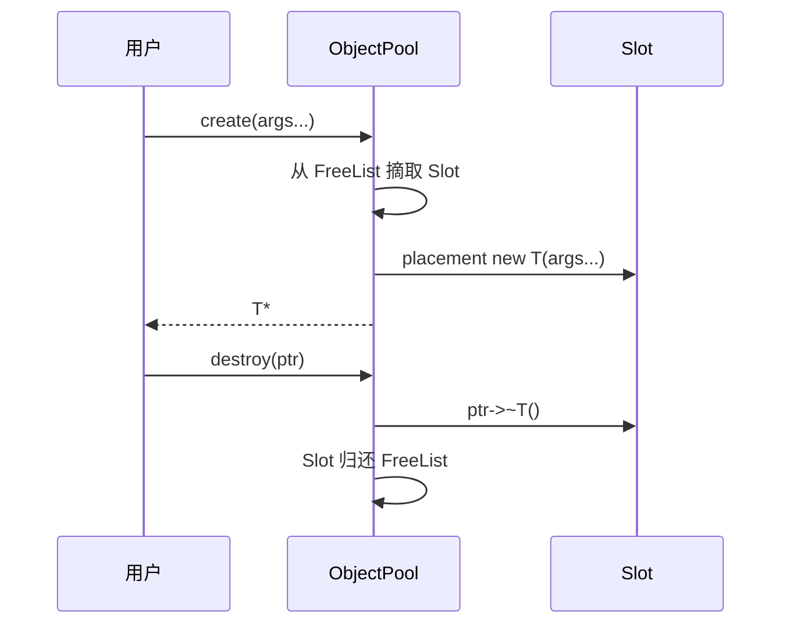
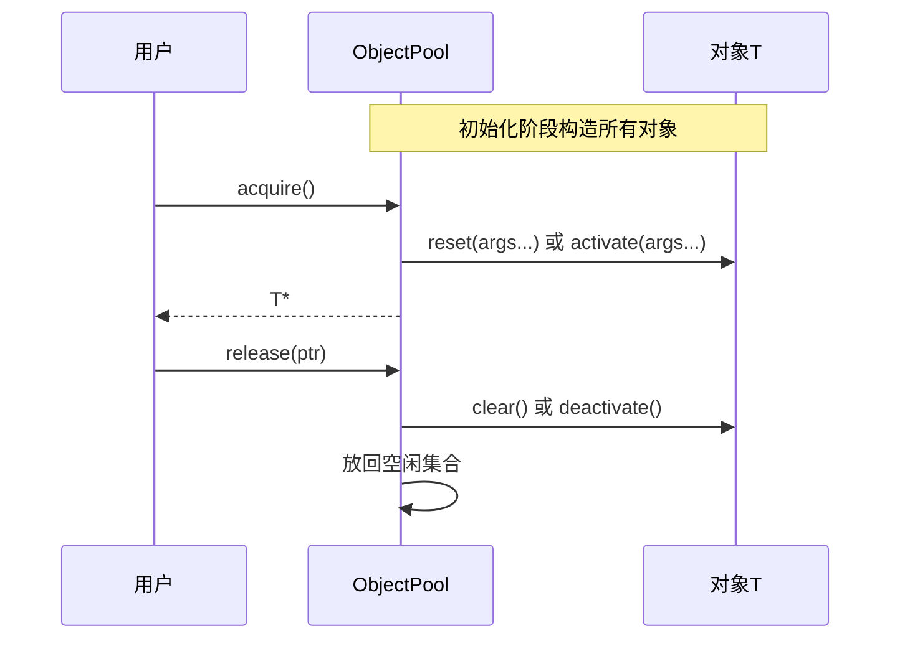
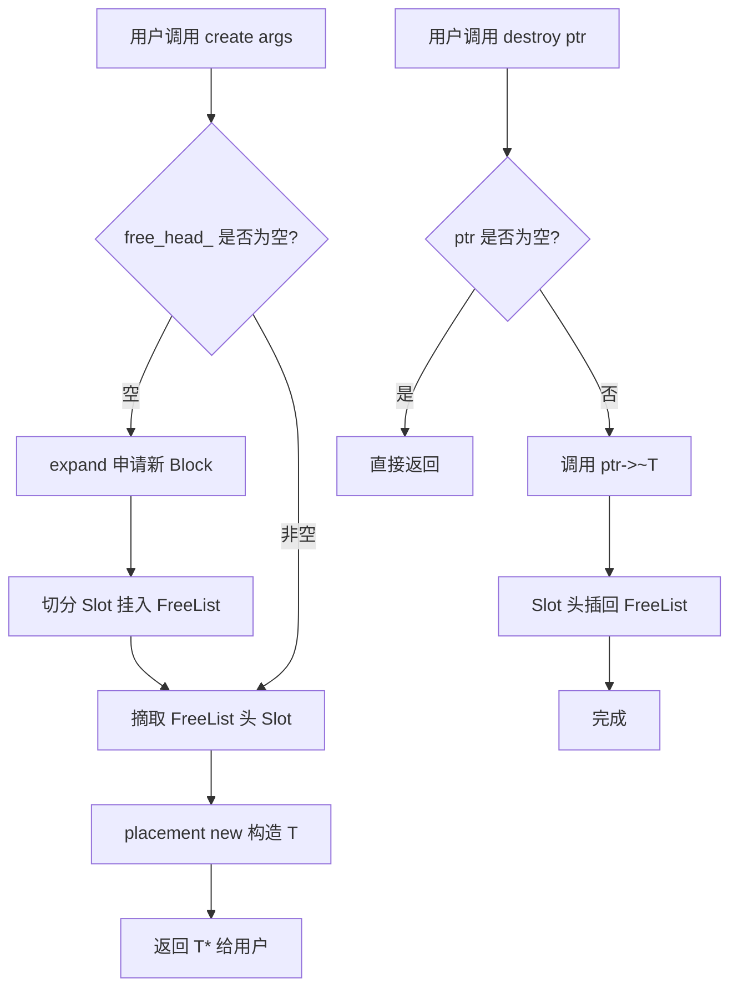
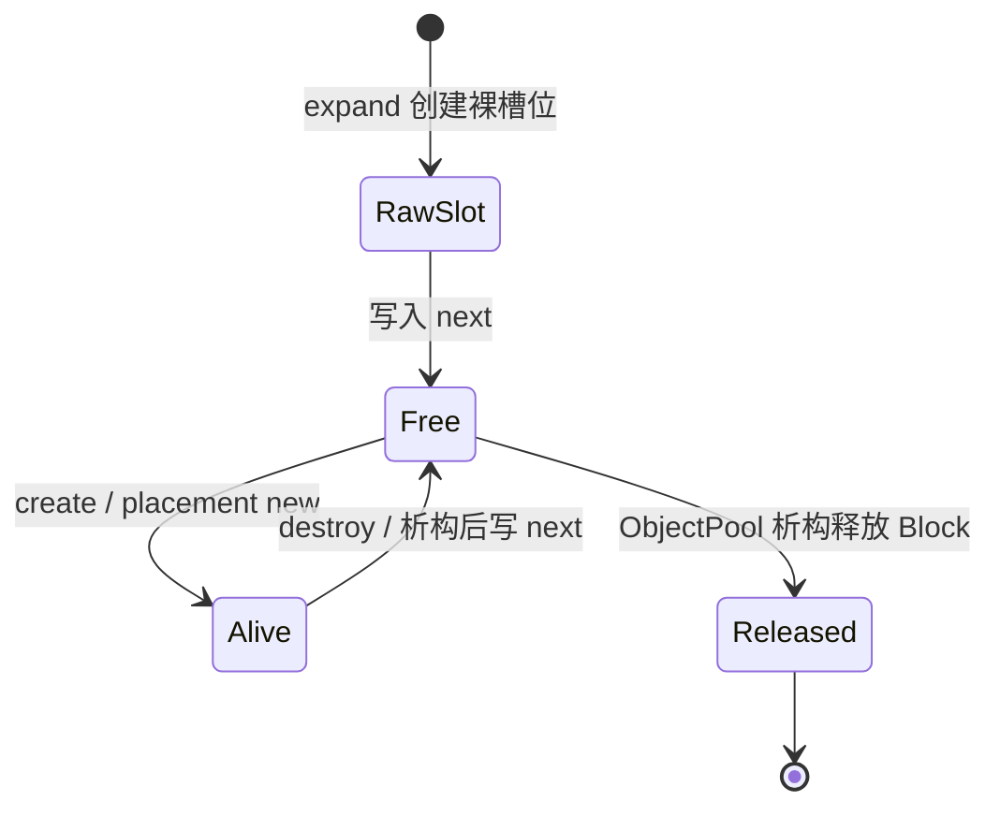
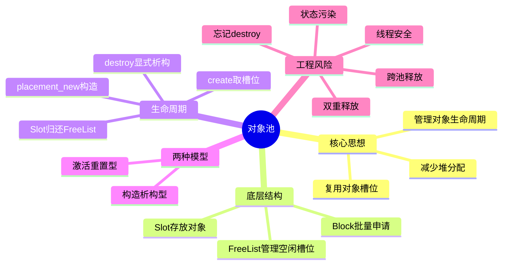

# 1. 背景与动机

## 1.1 对象创建/销毁的隐藏成本

在 C++ 中，`new T(args...)` 并不只是“申请一块内存”，它通常包含两个阶段：

```cpp
T* p = new T(args...);
```

等价于：

```cpp
void* mem = ::operator new(sizeof(T));  // 1. 分配裸内存
T* p = new (mem) T(args...);           // 2. 在原地构造对象
```

对应地，`delete p` 也包含两个阶段：

```cpp
p->~T();               // 1. 析构对象
::operator delete(p);  // 2. 释放裸内存
```

> [!note]
> 这里的 `T` 指的是**对象池要管理的对象类型**，也就是 C++ 模板里的类型参数。

如果某类对象被高频创建和销毁，则开销不仅来自堆分配，还来自对象自身的初始化、析构、资源申请和缓存失效。

| 开销来源 | 说明 | 典型影响 |
|---|---|---|
| **内存分配** | `operator new`/`malloc` 维护堆结构、可能触发锁或系统调用 | 延迟抖动 |
| **构造函数** | 初始化成员、申请内部资源、建立不变量 | CPU 开销 |
| **析构函数** | 释放资源、清理容器、关闭句柄 | CPU/系统调用 |
| **缓存失效** | 新对象地址分散，破坏空间局部性 | Cache Miss |
| **碎片问题** | 小对象频繁分配释放导致堆碎片 | RSS 增长 |

> [!warning]
> 在游戏实体、网络连接、粒子系统、协议消息、数据库连接等场景中，对象的生命周期可能非常短。如果每次都走完整的 `new/delete`，对象管理本身就会成为热点路径。

## 1.2 对象池的核心思想

> **对象池（Object Pool）通过复用已经分配好的对象存储空间，避免频繁向系统堆申请/释放内存，并把对象的构造、重置、析构流程封装起来。**

对象池与 [[08_内存池|内存池]] 的关系非常紧密：

- **内存池**关注“裸内存如何高效分配/回收”
- **对象池**关注“对象如何高效创建、复用、重置、销毁”

对象池通常以内存池为底层：

```text
对象池 = 定长内存池 + placement new + 显式析构 + 对象状态管理
```

核心收益：

- **减少堆分配**：对象空间从池中复用，热路径不碰系统堆。
- **稳定延迟**：分配/回收可做到 O(1)，适合实时场景。
- **缓存友好**：同类对象连续布局，提升空间局部性。
- **统一生命周期**：对象创建、销毁、重置都由池封装。
- **可加调试护栏**：检测泄漏、双重释放、跨池释放。

## 1.3 适用场景

| 场景 | 说明 |
|---|---|
| **游戏对象** | 子弹、粒子、Buff、临时碰撞体等高频生成/销毁对象 |
| **网络服务器** | 连接对象、请求上下文、定时器节点、消息包 |
| **数据库/线程资源** | 连接、线程、缓冲区等创建成本较高的资源 |
| **编译器/解析器** | AST 节点、Token、临时 IR 节点 |
| **实时系统** | 需要可预测延迟，避免运行期堆分配抖动 |

> [!tip]
> 可将对象池理解为：**把“反复买新杯子”变成“洗干净旧杯子再用”**。内存池解决杯子的存放和取还，对象池额外负责杯子当前是否干净、能不能再次使用。

---

# 2. 核心概念

## 2.1 对象池定义

> **对象池（Object Pool）**：预先持有一批对象存储槽位，在需要对象时从空闲槽位中取出并构造或激活对象，在对象使用结束后执行析构或重置逻辑，再将槽位归还到空闲集合中等待复用。

对象池管理的是“对象生命周期”，因此它比内存池多关心三件事：

1. **对象是否已经构造**
2. **对象被归还时是否需要析构或重置**
3. **对象再次取出时是否能保持正确状态**

## 2.2 对象池与内存池的区别

| 维度 | 内存池 | 对象池 |
|---|---|---|
| 管理对象 | 裸内存 Chunk | 具体类型 `T` 的对象槽位 |
| 分配结果 | `void*` 或字节块 | `T*`、智能指针或句柄 |
| 关注重点 | 对齐、碎片、FreeList、Block | 构造、析构、重置、对象状态 |
| 创建方式 | `allocate()` 返回原始内存 | `create(args...)` 内部 placement new |
| 回收方式 | `deallocate(void*)` | `destroy(T*)` 或 RAII 自动归还 |
| 易错点 | 对齐不足、跨池释放、双重释放 | 忘记析构、状态污染、悬空引用 |

> [!summary]
> **内存池解决“内存从哪里来”，对象池解决“对象如何活、如何死、如何再次复用”。**

## 2.3 关键术语

| 术语 | 含义 |
|---|---|
| **Slot（槽位）** | 对象池中可容纳一个 `T` 的存储单元 |
| **FreeList（空闲链表）** | 管理空闲 Slot 的单链表，支持 O(1) 取出/归还 |
| **Placement New** | 在已有内存上显式构造对象：`new (mem) T(args...)` |
| **Explicit Destructor** | 显式调用析构函数：`p->~T()` |
| **Reset（重置）** | 将对象状态恢复到可复用初始状态 |
| **Acquire/Release** | 从池中取得对象 / 将对象归还池中 |
| **RAII Handle** | 用智能指针或自定义句柄保证对象自动归还 |

## 2.4 对象池分类

| 类型 | 特点 | 适用 |
|---|---|---|
| **构造/析构型对象池** | 每次取出 placement new，每次归还显式析构 | 普通 C++ 对象，语义清晰 |
| **激活/重置型对象池** | 对象只构造一次，归还时 reset，下次直接复用 | 构造成本高、可安全重置 |
| **资源对象池** | 池化数据库连接、线程、缓冲区等外部资源 | 创建成本昂贵的对象 |
| **句柄对象池** | 返回 handle/id，避免裸指针悬空 | 游戏 ECS、资源管理系统 |
| **线程局部对象池** | 每线程独立池，无锁 | 高并发、对象不跨线程 |

---

# 3. 架构设计

## 3.1 整体架构

对象池可以直接复用定长内存池的核心结构：底层用 Block 批量申请内存，用 FreeList 管理空闲 Slot，上层封装 `create`/`destroy` 负责构造和析构。



## 3.2 Slot 内存布局

对象池中的每个 Slot 有两种状态：

```text
空闲态：

+----------------------+--------------------------+
| next*                | 未使用空间               |
+----------------------+--------------------------+
  ↑
  FreeList 链表指针


占用态：

+-------------------------------------------------+
| T 对象数据                                      |
+-------------------------------------------------+
```

这与内存池中的 Chunk 完全一致：**空闲时复用 Slot 前几个字节存 `next`，占用时整块内存都属于对象 `T`。**

> [!warning]
> Slot 大小必须同时满足两个条件：
> 
> - `sizeof(Slot) >= sizeof(T)`
> - `alignof(Slot) >= alignof(T)`

## 3.3 两种生命周期模型

对象池有两种常见生命周期设计。

### 3.3.1 构造/析构模型

每次获取对象时构造，每次归还对象时析构：



特点：

- 语义最接近 `new/delete`
- 不会保留旧对象状态
- 适合多数普通 C++ 类型
- 构造/析构成本仍然存在，但省掉了堆分配成本

### 3.3.2 激活/重置模型

对象在池初始化时构造一次，后续取出只调用 `reset` 或 `activate`：



特点：

- 进一步减少构造/析构开销
- 对象必须能被可靠重置
- 容易出现状态污染
- 适合连接、缓冲区、粒子、组件等可复用对象

> [!warning]
> 如果对象包含复杂资源、不变量严格或很难完整重置，优先使用构造/析构模型。**不完整的 reset 比频繁构造更危险。**

---

# 4. 构造/析构型对象池（示例）

## 4.1 关键代码实现

> 该实现直接复用 [[08_内存池|定长内存池]] 的 Block + FreeList 思路，但把 `allocate/deallocate` 封装成类型安全的 `create/destroy`。

```cpp
#include <cstddef>
#include <cstdint>
#include <new>
#include <type_traits>
#include <utility>

template <typename T>
class ObjectPool {
private:
	union Slot {
	    T object;   // 槽位被用户占用时：这里放真正的 T 对象
	    Slot* next; // 槽位空闲时：这里放 FreeList 的 next 指针
	
	    Slot() {}
	    ~Slot() {}
	};

    struct Block {
        Block* next;
        // 后续紧跟 Slot 数组
    };

    Block* block_head_;
    Slot*  free_head_;
    std::size_t block_capacity_;
    std::size_t live_count_;

    // 将地址 p 向后推进到满足 alignment 对齐的最近地址。
    static char* align_forward(char* p, std::size_t alignment) {
        auto addr = reinterpret_cast<std::uintptr_t>(p);
        auto aligned = (addr + alignment - 1) & ~(alignment - 1);
        return reinterpret_cast<char*>(aligned);
    }

    void expand(std::size_t count) {
        std::size_t raw_size =
            sizeof(Block) + alignof(Slot) - 1 + sizeof(Slot) * count;

        Block* block = static_cast<Block*>(::operator new(raw_size));
        block->next = block_head_;
        block_head_ = block;

        char* raw = reinterpret_cast<char*>(block) + sizeof(Block);
        char* base = align_forward(raw, alignof(Slot));

        for (std::size_t i = 0; i < count; ++i) {
            Slot* slot = reinterpret_cast<Slot*>(base + i * sizeof(Slot));
            slot->next = free_head_;
            free_head_ = slot;
        }
    }

    ObjectPool(const ObjectPool&) = delete;
    ObjectPool& operator=(const ObjectPool&) = delete;

public:
    explicit ObjectPool(std::size_t initial_capacity = 64)
        : block_head_(nullptr),
          free_head_(nullptr),
          block_capacity_(initial_capacity),
          live_count_(0) {
        expand(block_capacity_);
    }

    ~ObjectPool() {
        // 教学版要求用户在池析构前归还所有对象。
        // 生产版可在 Debug 下 assert(live_count_ == 0)。
        Block* cur = block_head_;
        while (cur) {
            Block* next = cur->next;
            ::operator delete(cur);
            cur = next;
        }
    }

    template <typename... Args>
    T* create(Args&&... args) {
        if (!free_head_) {
            expand(block_capacity_);
        }

        Slot* slot = free_head_;
        free_head_ = free_head_->next;

        T* obj = new (&slot->object) T(std::forward<Args>(args)...);
        ++live_count_;
        return obj;
    }

    void destroy(T* obj) {
        if (!obj) return;

        obj->~T();

        Slot* slot = reinterpret_cast<Slot*>(obj);
        slot->next = free_head_;
        free_head_ = slot;
        --live_count_;
    }

    std::size_t live_count() const {
        return live_count_;
    }
};
```

## 4.2 代码解析

### 4.2.1 整体结构：对象池比内存池多一层类型语义

`ObjectPool<T>` 内部同样维护两条链表：

| 链表 | 节点 | 头指针 | 用途 |
|---|---|---|---|
| **Block 链表** | `Block` | `block_head_` | 串联所有大块内存，析构时统一归还 |
| **FreeList** | `Slot` | `free_head_` | 管理当前空闲槽位，支持 O(1) 取出/归还 |

与内存池不同的是，对象池返回的不再是 `void*`，而是类型明确的 `T*`：

```text
ObjectPool<T>
    ├── 负责内存：Block + FreeList
    └── 负责对象：placement new + explicit destructor
```

因此用户不再需要手写：

```cpp
void* mem = pool.allocate();
T* obj = new (mem) T(args...);
obj->~T();
pool.deallocate(obj);
```

而是使用：

```cpp
T* obj = pool.create(args...);
pool.destroy(obj);
```

> [!summary]
> 对象池的核心价值之一，就是把容易写错的 placement new 和显式析构封装起来，让调用者只面对类型安全的对象接口。

### 4.2.2 `union Slot`：同一片内存的两种解释

```cpp
union Slot {
    T object;
    Slot* next;

    Slot() {}
    ~Slot() {}
};
```

`Slot` 使用 `union` 表达“同一片内存不会同时保存对象和链表指针”：

| 状态 | 活跃成员 | 含义 |
|---|---|---|
| **空闲态** | `next` | 该 Slot 是 FreeList 节点 |
| **占用态** | `object` | 该 Slot 中构造了一个 `T` 对象 |

```text
空闲态：

Slot
+-------------------+
| next              |
+-------------------+

占用态：

Slot
+-------------------+
| object: T         |
+-------------------+
```

`union Slot` 的两个优势：

1. **自动满足大小要求**：`sizeof(Slot) >= max(sizeof(T), sizeof(Slot*))`
2. **自动满足对齐要求**：`alignof(Slot) >= max(alignof(T), alignof(Slot*))`

> [!tip]
> 这比手动计算 `chunk_size = max(sizeof(T), sizeof(void*))` 更类型安全，也更贴近“对象池只管理一种 T”的语义。

### 4.2.3 `Block`：大块内存的所有权记录

```cpp
struct Block {
    Block* next;
    // 后续紧跟 Slot 数组
};
```

每次扩容都会向系统申请一整块原始内存：

```text
+------------+---------+---------+---------+-----+
| Block头    | Slot0   | Slot1   | Slot2   | ... |
+------------+---------+---------+---------+-----+
```

`Block` 头部只负责串联所有大块，最终析构时统一释放：

```text
block_head_
    |
    v
+---------+      +---------+      +---------+
| Block A | ---> | Block B | ---> | Block C | ---> nullptr
+---------+      +---------+      +---------+
```

> [!info]
> FreeList 中的 Slot 都位于某个 Block 内部，因此**析构时只需要释放 Block 链表，不需要逐个释放 Slot**。

### 4.2.4 `expand()`：申请 Block 并切成 Slot

`expand()` 是对象池与系统堆交互的唯一冷路径，负责一次性申请一块大内存，然后把它切成多个满足 `T` 大小与对齐要求的 `Slot`，最后全部挂入 FreeList。

```cpp
void expand(std::size_t count) {
    // 1. 计算所需字节：Block 头 + 对齐余量 + count 个 Slot
    std::size_t raw_size =
        sizeof(Block) + alignof(Slot) - 1 + sizeof(Slot) * count;

    // 2. 向系统申请原始内存（只分配字节，不构造 T）
    Block* block = static_cast<Block*>(::operator new(raw_size));

    // 3. 头插法插入 Block 链表，记录这块大内存的所有权
    block->next = block_head_;
    block_head_ = block;

    // 4. 跳过 Block 头部，得到候选 Slot 起点 raw
    char* raw = reinterpret_cast<char*>(block) + sizeof(Block);

    // 5. 将 raw 向后推进到满足 alignof(Slot) 的合法地址
    char* base = align_forward(raw, alignof(Slot));

    // 6. 从 base 开始切分 Slot，并全部头插到 FreeList
    for (std::size_t i = 0; i < count; ++i) {
        Slot* slot = reinterpret_cast<Slot*>(base + i * sizeof(Slot));
        slot->next = free_head_;
        free_head_ = slot;
    }
}
```

下面按 **容量计算 → 原始内存申请 → Block 链表 → Slot 起点定位 → 地址对齐 → FreeList 构建** 的顺序逐步拆解。

#### 步骤 1 — 计算容量

```cpp
std::size_t raw_size =
    sizeof(Block) + alignof(Slot) - 1 + sizeof(Slot) * count;
```

对象池申请的大块内存由三部分组成：

| 部分 | 作用 |
|---|---|
| `sizeof(Block)` | 存放 Block 管理头，用于串联所有大块 |
| `alignof(Slot) - 1` | 给**手动地址对齐**预留的最大偏移量 |
| `sizeof(Slot) * count` | 真正存放 `count` 个 Slot 的连续区域 |

> [!question] 为什么要多申请 `alignof(Slot) - 1` 字节？
> 因为 `raw` 经过 `align_forward()` 后可能向后移动，最多移动 `alignment - 1` 字节。如果不预留这段空间，对齐后的 `base` 虽然合法，但最后一个 Slot 可能越过 Block 尾部。

对于上述问题的回答，可以换成更直观的说法：**`alignof(Slot) - 1` 是给“对齐时被跳过的 padding”预留空间。**

对象池真正想要的布局是：

```
Block Header 后面，放 count 个完整 Slot
```

也就是：

```
			  raw
			   |
			   v
+--------------+--------+--------+--------+--------+
| Block Header | Slot0  | Slot1  | Slot2  | Slot3  |
+--------------+--------+--------+--------+--------+
```

但问题是：`Block Header` 后面的第一个地址 `raw` 不一定对齐。

假设：

```
sizeof(Block) = 8
sizeof(Slot)  = 64
alignof(Slot) = 32  <- Slot 要求 32B 对齐
count         = 4
block         = 0x1000
```

跳过 `Block Header` 后：

```
raw = 0x1000 + 8 = 0x1008
```

但 `Slot` 要求 32 字节对齐，合法地址必然是下面这种：

```
..., 0x1000, 0x1020, 0x1040, 0x1060, 0x1080, ...
```

`0x1008` 不合法，所以要往后推到 `base = 0x1020`，这中间跳过了：

```
0x1020 - 0x1008 = 0x18 = 24 bytes
```

也就是 24 字节 padding。

图上是这样：

```
0x1000          0x1008                  0x1020
  |               |                       |
  v               v                       v
  +---------------+-----------------------+--------+--------+--------+--------+
  | Block Header  | padding 24 bytes      | Slot0  | Slot1  | Slot2  | Slot3  |
  +---------------+-----------------------+--------+--------+--------+--------+
                  ^
                 raw，不对齐
                                          ^
                                        base，对齐后的 Slot 起点
```

现在关键来了。如果你只申请：

```
sizeof(Block) + sizeof(Slot) * count
```

也就是：

```
8 + 64 * 4 = 264 bytes
```

那么从 `raw` 开始到 Block 结束，刚好只有 256 字节，正好够 4 个 Slot。

但是你为了对齐，从 `raw` 往后跳了 24 字节：

```
可用空间从 256 bytes 变成 256 - 24 = 232 bytes
```

空间不够了，最后一个 Slot 必然会越界。因此要额外申请一段空间，专门给 `align_forward()` 可能跳过的 padding 用：

```
std::size_t raw_size =
    sizeof(Block) + alignof(Slot) - 1 + sizeof(Slot) * count;
```

> [!question] 为什么是 `alignof(Slot) - 1`？
> 因为一个地址向后对齐时，最多只可能跳过 `alignment - 1` 字节。

比如 32 字节对齐：

```
已经对齐：跳过 0 字节
差 1 字节对齐：跳过 1 字节
差 31 字节对齐：跳过 31 字节
```

最多就是：

```
32 - 1 = 31 bytes
```

所以 `alignof(Slot) - 1` 是最坏情况兜底。

> [!tip]
> `alignof(Slot) - 1` 不是一定都会用完，而是给最坏情况兜底。若 `raw` 已经对齐，这部分空间可能完全不用；若 `raw` 差一点才对齐，就从这里消耗若干字节。

#### 步骤 2 — 申请原始内存

```cpp
Block* block = static_cast<Block*>(::operator new(raw_size));
```

`::operator new(raw_size)` 只做一件事：**向系统堆申请 `raw_size` 字节的原始内存**。它不会构造 `Block`，也不会构造任何 `T` 对象。

此时内存只是一段未初始化的字节：

```text
block
  |
  v
  +-------------------------------------------------------------------+
  | 原始字节区域 raw bytes                                            |
  | 尚未形成 Slot，也没有任何 T 对象处于生命周期内                    |
  +-------------------------------------------------------------------+
```

将返回值转成 `Block*` 后，对象池把这块内存的开头解释为 `Block` 管理头：

```text
block
  |
  v
  +--------------+----------------------------------------------------+
  | Block Header | 后续区域暂时仍是原始字节                           |
  +--------------+----------------------------------------------------+
```

> [!warning]
> 这里的 `Block*` 只是把内存开头当作管理头使用；真正的 `T` 对象要等 `create()` 中的 placement new 才会被构造。

#### 步骤 3 — 挂入 Block 链表

```cpp
block->next = block_head_;
block_head_ = block;
```

每次 `expand()` 申请到的新 Block，都用头插法挂入 `block_head_` 链表。这个链表的职责不是分配对象，而是记录“对象池到底向系统申请过哪些大块内存”，方便析构时统一释放。

```text
扩容前：

block_head_
    |
    v
+---------+      +---------+
| Block B | ---> | Block A | ---> nullptr
+---------+      +---------+


申请到新 Block C 后：

block
  |
  v
+---------+
| Block C |
+---------+


头插完成后：

block_head_
    |
    v
+---------+      +---------+      +---------+
| Block C | ---> | Block B | ---> | Block A | ---> nullptr
+---------+      +---------+      +---------+
```

> [!info]
> Block 链表只管“大块内存所有权”；FreeList 才管“哪些 Slot 当前空闲”。二者共享同一片物理内存，但服务目标不同。

#### 步骤 4 — 定位候选 Slot 起点 `raw`

```cpp
char* raw = reinterpret_cast<char*>(block) + sizeof(Block);
```

`raw` 是跳过 `Block` 头部后的第一个地址，也就是 Slot 区域的**候选起点**。

必须先把 `block` 转成 `char*`，因为指针加法的单位取决于指针类型：

| 表达式 | 实际移动 |
|---|---|
| `block + 1` | 移动 `sizeof(Block)` 字节 |
| `reinterpret_cast<char*>(block) + 1` | 移动 1 字节 |
| `reinterpret_cast<char*>(block) + sizeof(Block)` | 精确移动 `sizeof(Block)` 字节 |

所以这行代码的语义是：

```text
从整块内存首地址 block 开始，向后移动 sizeof(Block) 字节。
```

图示：

```text
block
  |
  v
+--------------+----------------------------------------------------+
| Block Header | raw                                                |
| sizeof(Block)| 候选 Slot 起点                                      |
+--------------+----------------------------------------------------+
               ^
               raw = reinterpret_cast<char*>(block) + sizeof(Block)
```

但注意：`raw` 只是候选起点，**它不一定满足 `alignof(Slot)` 对齐要求**。

#### 步骤 5 — 对齐 Slot 起点 `base`

```cpp
char* base = align_forward(raw, alignof(Slot));
```

`::operator new` 返回的 `block` 起点通常满足最大基础对齐，但跳过 `Block Header` 后得到的 `raw` 不一定仍然对齐。

假设：

```text
block          = 0x1000
sizeof(Block)  = 8
alignof(Slot)  = 32
```

那么：

```text
raw = 0x1000 + 8 = 0x1008
```

布局如下：

```text
0x1000
  |
  v
+----------------+------------------------+-----------------------------+
| Block Header   | padding                | Slot0                       |
| 0x1000~0x1007  | 0x1008~0x101F          | 从 0x1020 开始              |
+----------------+------------------------+-----------------------------+
                 ^                        ^
                 raw = 0x1008             base = 0x1020
```

`0x1008` 不是 32 字节对齐，因为：

```text
0x1008 % 32 = 8
```

> [!tip]
> 0x1008 % 32 可以写成 0x1008 % $2^5$（幂为 5），因此只需要把 0x1008 展开成 2 进制（0001 0000 0000 1000），看后 5 位即可：后 5 位为 0 1000（不为 0），故不按 32 字节对齐。

所以不能直接把 `raw` 当作 `Slot*`。必须把它向后推进到最近的 32 字节边界：

```text
base = 0x1020
```

`align_forward()` 的实现如下：

```cpp
static char* align_forward(char* p, std::size_t alignment) {
    auto addr = reinterpret_cast<std::uintptr_t>(p);
    auto aligned = (addr + alignment - 1) & ~(alignment - 1);
    return reinterpret_cast<char*>(aligned);
}
```

它和内存池中的 `align_upward()` 本质公式相同，但对齐对象不同：

| 函数 | 对齐对象 | 例子 | 含义 |
|---|---|---|---|
| `align_upward(size, alignment)` | **字节大小** | `align_upward(13, 8) == 16` | 把大小补到 8 的整数倍 |
| `align_forward(p, alignment)` | **内存地址** | `align_forward(0x1003, 8) == 0x1008` | 把地址推到下一个 8 字节边界 |

指针不能直接参与位运算，因此第一步要把地址转成整数：

```cpp
auto addr = reinterpret_cast<std::uintptr_t>(p);
```

核心公式：

```cpp
(addr + alignment - 1) & ~(alignment - 1)
```

含义是：

1. `addr + alignment - 1`：先把地址推过可能的对齐边界。
2. `~(alignment - 1)`：构造低位清零的掩码。
3. `&`：清掉低位，得到最近的合法对齐地址。

以 `addr = 0x1008`、`alignment = 32` 为例：

```text
alignment - 1 = 31 = 2^5 - 1 = 0001 1111 = 0x1F
~0x1F = 0xFFE0 -> 会清掉低 5 位

addr + alignment - 1 = 0x1008 + 0x1F = 0x1027

0x1027 & ~0x1F = 0x1020
```

因此：

```cpp
align_forward(reinterpret_cast<char*>(0x1008), 32)
```

返回：

```text
0x1020
```

如果地址本来已经满足对齐，则结果保持不变：

```text
addr = 0x1020
alignment = 32

0x1020 + 0x1F = 0x103F
0x103F & ~0x1F = 0x1020
```

> [!warning]
> `(addr + alignment - 1) & ~(alignment - 1)` 的位运算写法要求 `alignment` 是 2 的幂。C++ 类型的 `alignof(T)` 通常满足这一条件。

#### 步骤 6 — 切分 Slot 并挂入 FreeList

```cpp
for (std::size_t i = 0; i < count; ++i) {
    Slot* slot = reinterpret_cast<Slot*>(base + i * sizeof(Slot));
    slot->next = free_head_;
    free_head_ = slot;
}
```

`base + i * sizeof(Slot)` 用于定位第 `i` 个 Slot 的起始地址；`reinterpret_cast<Slot*>` 表示“把这块空闲内存解释成一个 Slot 节点”。

继续使用前面的例子：

```text
base         = 0x1020
sizeof(Slot)= 64
count        = 4
```

则切分结果为：

| Slot | 地址范围 |
|---|---|
| `Slot0` | `0x1020 ~ 0x105F` |
| `Slot1` | `0x1060 ~ 0x109F` |
| `Slot2` | `0x10A0 ~ 0x10DF` |
| `Slot3` | `0x10E0 ~ 0x111F` |

内存布局：

```text
0x1000          0x1008          0x1020          0x1060          0x10A0          0x10E0
  |               |               |               |               |               |
  v               v               v               v               v               v
  +---------------+---------------+---------------+---------------+---------------+---------------+-------------+
  | Block Header  | padding       | Slot0         | Slot1         | Slot2         | Slot3         | 多出的空间  |
  +---------------+---------------+---------------+---------------+---------------+---------------+-------------+
                                  ^
                                  base
```

每个 Slot 在空闲态时，其内部有效成员是 `next`：

```text
Slot0 @ 0x1020
+----------------------+--------------------------------+
| next 指针            | Slot 剩余空间                  |
| sizeof(Slot*) bytes  | 可供 T 对象构造时覆盖          |
+----------------------+--------------------------------+
```

这里要区分两个“slot”：

```text
局部变量 slot：

+----------------+
| 0x1060         |
+----------------+
       |
       v

存放的是对象池里的 Slot 内存首地址：

0x1060
+----------------------+--------------------------------+
| next = free_head_    | 空闲态剩余空间                 |
+----------------------+--------------------------------+
```

`slot` 这个局部变量只是保存地址；`slot->next = free_head_;` 写入的是 **`slot` 指向的那块 Slot 内存开头的 `next` 字段**。

假设进入循环前：

```text
free_head_ = nullptr
```

循环第 0 次：

```cpp
slot = Slot0;
slot->next = nullptr;
free_head_ = Slot0;
```

```text
free_head_
   |
   v
+-------+
| Slot0 | ---> nullptr
+-------+
```

循环第 1 次：

```cpp
slot = Slot1;
slot->next = free_head_;  // Slot1->next = Slot0
free_head_ = Slot1;
```

```text
free_head_
   |
   v
+-------+      +-------+
| Slot1 | ---> | Slot0 | ---> nullptr
+-------+      +-------+
```

循环第 2 次后：

```text
free_head_
   |
   v
+-------+      +-------+      +-------+
| Slot2 | ---> | Slot1 | ---> | Slot0 | ---> nullptr
+-------+      +-------+      +-------+
```

循环第 3 次后：

```text
free_head_
   |
   v
+-------+      +-------+      +-------+      +-------+
| Slot3 | ---> | Slot2 | ---> | Slot1 | ---> | Slot0 | ---> nullptr
+-------+      +-------+      +-------+      +-------+
```

最终，`expand(4)` 完成后，这 4 个 Slot 都处于空闲态，等待 `create()` 从 FreeList 头部取出并 placement new 构造 `T`。

> [!summary]
> `expand()` 的核心流程是：**申请大块 → 记录所有权 → 跳过 Header → 对齐 Slot 起点 → 按 `sizeof(Slot)` 切分 → 头插 FreeList**。其中 `align_forward()` 是对象池比教学版内存池更严谨的地方，因为对象 `T` 可能有比普通指针更高的对齐要求。

### 4.2.5 `create()`：取出 Slot 并构造对象

```cpp
template <typename... Args>
T* create(Args&&... args) {
    if (!free_head_) {
        expand(block_capacity_);
    }

    Slot* slot = free_head_;
    free_head_ = free_head_->next;

    T* obj = new (&slot->object) T(std::forward<Args>(args)...);
    ++live_count_;
    return obj;
}
```

执行过程：

```text
create(args...)
    |
    v
FreeList 是否为空？
    |
    +-- 是 --> expand()
    |
    v
摘取 free_head_ 指向的 Slot
    |
    v
placement new 在 Slot 中构造 T
    |
    v
返回 T*
```

关键点：

- `slot` 在摘下前是空闲节点，内部保存 `next`。
- `new (&slot->object) T(...)` 会在同一片内存中激活 `object` 成员。
- 构造完成后，该 Slot 不再属于 FreeList，而是属于用户。

> [!tip]
> `std::forward<Args>(args)...` 用于完美转发构造参数，使 `pool.create(a, b, c)` 的语义尽量接近 `new T(a, b, c)`。

### 4.2.6 `destroy()`：析构对象并归还 Slot

```cpp
void destroy(T* obj) {
    if (!obj) return;

    obj->~T();

    Slot* slot = reinterpret_cast<Slot*>(obj);
    slot->next = free_head_;
    free_head_ = slot;
    --live_count_;
}
```

执行过程：

```text
destroy(obj)
    |
    v
显式调用 obj->~T()
    |
    v
把 obj 地址重新解释为 Slot*
    |
    v
写入 slot->next
    |
    v
头插回 FreeList
```

这里的顺序不能颠倒：

1. 必须先 `obj->~T()`，因为对象还处于活跃状态。
2. 析构完成后，`T` 的生命周期结束。
3. 此时可以把同一片内存重新作为 `Slot::next` 使用。

> [!warning]
> 如果先写 `slot->next` 再调用析构函数，就可能破坏对象前几个字节，导致析构函数读取到已经被污染的对象状态。

### 4.2.7 析构函数：只释放内存，不替用户析构活对象

```cpp
~ObjectPool() {
    Block* cur = block_head_;
    while (cur) {
        Block* next = cur->next;
        ::operator delete(cur);
        cur = next;
    }
}
```

教学版析构函数只负责释放所有 Block，并不遍历活对象调用析构函数。

原因是：FreeList 只记录空闲 Slot，并不记录哪些 Slot 当前活跃。若要池析构时自动析构活对象，需要额外维护：

- 活对象链表
- 位图 Bitmap
- `in_use` 标记
- 构造状态表

> [!warning]
> 在当前实现中，用户必须保证池析构前所有对象都已 `destroy`。否则对象内部资源不会释放，例如 `std::string`、文件句柄、网络连接等。

## 4.3 RAII 自动归还版本

裸 `T*` 接口简单，但用户容易忘记 `destroy`。更安全的方式是返回带自定义删除器的 `std::unique_ptr`。

```cpp
#include <memory>

template <typename T>
class ObjectPoolWithHandle : public ObjectPool<T> {
public:
    using ObjectPool<T>::ObjectPool;

    struct Deleter {
        ObjectPoolWithHandle* pool;

        void operator()(T* p) const {
            if (p) {
                pool->destroy(p);
            }
        }
    };

    using Ptr = std::unique_ptr<T, Deleter>;

    template <typename... Args>
    Ptr make(Args&&... args) {
        return Ptr(
            this->create(std::forward<Args>(args)...),
            Deleter{this}
        );
    }
};
```

使用方式：

```cpp
struct Bullet {
    float x;
    float y;
    float speed;

    Bullet(float x_, float y_, float s)
        : x(x_), y(y_), speed(s) {}
};

int main() {
    ObjectPoolWithHandle<Bullet> pool(256);

    auto bullet = pool.make(10.0f, 20.0f, 30.0f);

    // bullet 离开作用域时自动调用 pool.destroy()
}
```

> [!summary]
> RAII 版本把“归还对象”绑定到智能指针生命周期，能显著减少忘记释放、异常路径泄漏等问题。

## 4.4 激活/重置型对象池

如果对象构造成本很高，且可以被可靠重置，可以让对象只构造一次，后续通过 `reset` 重用。

```cpp
#include <vector>

template <typename T>
class ReusableObjectPool {
private:
    std::vector<T> objects_;
    std::vector<T*> free_list_;

public:
    template <typename... Args>
    explicit ReusableObjectPool(std::size_t count, Args&&... args) {
        objects_.reserve(count);
        free_list_.reserve(count);

        for (std::size_t i = 0; i < count; ++i) {
            objects_.emplace_back(std::forward<Args>(args)...);
            free_list_.push_back(&objects_.back());
        }
    }

    template <typename... Args>
    T* acquire(Args&&... args) {
        if (free_list_.empty()) {
            return nullptr;
        }

        T* obj = free_list_.back();
        free_list_.pop_back();
        obj->reset(std::forward<Args>(args)...);
        return obj;
    }

    void release(T* obj) {
        if (!obj) return;
        obj->clear();
        free_list_.push_back(obj);
    }
};
```

示例对象：

```cpp
#include <string>

struct Message {
    int id = 0;
    std::string payload;

    void reset(int new_id, std::string text) {
        id = new_id;
        payload = std::move(text);
    }

    void clear() {
        id = 0;
        payload.clear();
    }
};
```

这种方式没有频繁构造/析构，但要求 `reset/clear` 覆盖全部状态。

> [!warning]
> 激活/重置型对象池最常见 Bug 是“旧状态残留”。例如布尔标记、缓存字段、回调指针没有清理，下次复用时就会表现得像随机错误。

---

# 5. 数据流

## 5.1 构造/析构型对象池数据流



要点：

- **分配热路径**：摘 FreeList 头 + placement new。
- **回收热路径**：显式析构 + 头插 FreeList。
- **扩容冷路径**：当 FreeList 为空时批量申请新 Block。

## 5.2 内存状态流转



对象生命周期只存在于 `Alive` 状态：

| 状态 | 内存存在吗 | `T` 对象存在吗 | 可以访问 `T` 成员吗 |
|---|---|---|---|
| `RawSlot` | 是 | 否 | 否 |
| `Free` | 是 | 否 | 否 |
| `Alive` | 是 | 是 | 是 |
| `Released` | 否 | 否 | 否 |

> [!warning]
> 指针地址相同不代表对象生命周期还存在。`destroy(p)` 后，`p` 指向的内存可能仍在池中，但 `T` 对象已经死亡，继续访问就是未定义行为。

---

# 6. 性能分析

## 6.1 与 `new/delete` 对比

| 维度 | `new/delete` | 对象池 |
|---|---|---|
| 内存分配 | 每次可能访问通用堆 | 热路径从 FreeList O(1) 取槽 |
| 对象构造 | 每次构造 | 构造/析构型仍构造；重置型可减少构造 |
| 对象析构 | 每次析构 | 构造/析构型仍析构；重置型可延后 |
| 内存局部性 | 地址可能分散 | 同类对象集中在 Block 中 |
| 延迟稳定性 | 受堆状态、锁、系统调用影响 | 更稳定，可预测 |
| 泛用性 | 任意类型、任意大小 | 通常每个池只服务一种类型 |

## 6.2 对象池能优化什么

对象池并不是把所有成本都消除，而是分层优化：

| 成本 | 构造/析构型对象池 | 激活/重置型对象池 |
|---|---|---|
| 系统堆分配 | **大幅减少** | **大幅减少** |
| 对象构造 | 仍然存在 | 可减少 |
| 对象析构 | 仍然存在 | 可减少 |
| 内部资源分配 | 取决于构造函数 | 可通过复用减少 |
| Cache Miss | 改善 | 改善 |

> [!summary]
> 如果瓶颈主要是堆分配，用构造/析构型对象池即可；如果瓶颈还包括对象内部初始化，则需要重置型对象池，但必须承担状态正确性的风险。

## 6.3 内存开销

设 `sizeof(T)=48`、`sizeof(void*)=8`、首批 `count=1024`：

- `sizeof(Slot) ≈ 48`
- 对象数据区约 `48 × 1024 = 48 KB`
- Block 头部开销通常只有 8 字节
- FreeList 不需要额外节点，因为空闲 Slot 自身存 `next`

对象池的主要额外成本来自：

1. **预分配未使用的 Slot**
2. **扩容后暂时闲置的 Block**
3. **调试信息**（如 magic、in-use 标记、统计计数）

## 6.4 适用边界

对象池适合以下特征同时出现的场景：

- 对象类型固定或少量固定
- 创建/销毁频率高
- 生命周期较短
- 峰值数量可估算
- 对延迟稳定性有要求

不适合：

- 对象很少创建
- 对象大小差异大
- 生命周期复杂且跨多个所有者
- 对象很难重置
- 使用对象池会显著增加代码复杂度

---

# 7. 易错点

| # | 陷阱 | 后果 | 规避 |
|---|---|---|---|
| 1 | **忘记调用 `destroy`** | 析构函数不执行，资源泄漏 | 使用 RAII handle 或 `unique_ptr` 自定义删除器 |
| 2 | **双重归还** | FreeList 形成环或重复分配同一对象 | 加 `in_use` 标记、magic 校验 |
| 3 | **跨池释放** | A 池对象被还给 B 池，内存结构破坏 | 检查指针是否落在本池 Block 范围内 |
| 4 | **析构顺序错误** | 先写 `next` 会破坏对象内容 | 必须先 `obj->~T()` 再挂回 FreeList |
| 5 | **状态重置不完整** | 旧状态污染新对象 | reset/clear 覆盖全部字段，写单元测试 |
| 6 | **持有归还后的指针** | Use-After-Free，访问已死亡对象 | 归还后立刻置空，优先用句柄 |
| 7 | **对象池先析构** | 活对象持有的池指针失效 | 确保池生命周期长于池中对象 |
| 8 | **多线程无同步** | FreeList 竞争，内存链表损坏 | 加锁、ThreadLocal 池或无锁结构 |
| 9 | **异常安全不足** | 构造抛异常时 Slot 丢失 | 构造失败要把 Slot 放回 FreeList |
| 10 | **对齐不足** | 未定义行为或性能下降 | 使用 `union Slot` 或 `std::aligned_storage` 思路 |

## 7.1 构造异常的处理

经典版 `create()` 还有一个隐藏问题：如果 `T` 的构造函数抛异常，Slot 已经从 FreeList 摘下，但没有成功构造对象。

更严谨的写法：

```cpp
template <typename... Args>
T* create(Args&&... args) {
    if (!free_head_) {
        expand(block_capacity_);
    }

    Slot* slot = free_head_;
    free_head_ = free_head_->next;

    try {
        T* obj = new (&slot->object) T(std::forward<Args>(args)...);
        ++live_count_;
        return obj;
    } catch (...) {
        slot->next = free_head_;
        free_head_ = slot;
        throw;
    }
}
```

> [!warning]
> 对象池代码常处于底层基础设施位置，异常安全不能忽略。构造失败时必须保证池的 FreeList 仍然完整。

## 7.2 `reset` 不等于析构

```cpp
void clear() {
    payload.clear();
}
```

`clear()` 只是清空字符串内容，不一定释放容量；这通常正是复用型对象池想要的效果，因为下次可以复用已有 buffer。

但它也意味着：

- 内存峰值可能被长期保留
- 敏感数据可能仍存在于 capacity 中
- 没有清理的字段会继续残留

> [!tip]
> 对重置型对象池，要明确区分：**逻辑清空**、**资源释放**、**安全擦除**。这三者不是一回事。

---

# 8. 最佳实践

1. **优先封装类型安全接口**：对外提供 `create/destroy` 或 `make`，不要暴露裸 `allocate/deallocate`。
2. **默认选择构造/析构模型**：它语义接近 `new/delete`，状态污染风险较低。
3. **谨慎使用重置模型**：只有当构造成本明显很高，且对象能被完整 reset 时再使用。
4. **用 RAII 管理归还**：返回 `unique_ptr<T, Deleter>` 或自定义 handle，减少忘记 `destroy`。
5. **池生命周期要足够长**：对象不能比对象池活得更久，否则删除器或归还逻辑会悬空。
6. **加入调试统计**：维护 `live_count`、`peak_count`、`block_count`，Debug 下断言无泄漏。
7. **防御双重释放**：生产实现可在 Slot 旁增加 magic、generation、in-use 位。
8. **选择合适扩容策略**：固定批次简单稳定，指数扩容减少扩容次数但可能浪费更多内存。
9. **线程模型提前设计**：单线程池最简单；多线程场景优先 ThreadLocal，跨线程归还要明确归属。
10. **只池化热点对象**：不要为了“看起来高级”池化所有对象，池化本身也会增加复杂度。

---

# 9. 与内存池的复用关系

## 9.1 可以直接复用的部分

对象池可以直接复用内存池中的以下机制：

| 内存池机制 | 对象池中的作用 |
|---|---|
| **Block 批量申请** | 降低系统堆调用频率 |
| **FreeList 空闲链表** | O(1) 管理空闲 Slot |
| **Chunk/Slot 复用 next** | 空闲节点零额外内存 |
| **对齐处理** | 保证 `T` 可安全放入 Slot |
| **按需 expand** | 空间不足时批量扩容 |
| **统计与调试护栏** | 检测泄漏、越界、双重释放 |

## 9.2 对象池新增的部分

对象池不能只停留在“内存复用”，还必须补齐对象语义：

| 新增能力 | 原因 |
|---|---|
| **构造参数转发** | 让 `create(args...)` 接近 `new T(args...)` |
| **显式析构** | 释放对象内部资源 |
| **异常安全** | 构造失败不能破坏 FreeList |
| **RAII 归还** | 避免手动 `destroy` 遗漏 |
| **状态重置策略** | 支持长期复用昂贵对象 |
| **活对象统计** | 池析构时检测未归还对象 |

> [!summary]
> 内存池是对象池的基础设施；对象池是在内存池之上补齐 C++ 对象生命周期语义。

---

# 10. 总结



- 对象池本质是：**定长内存池 + C++ 对象生命周期管理**。
- 内存池只关心字节块，对象池还要关心 `T` 的构造、析构、重置和所有权。
- 构造/析构型对象池语义清晰，适合作为默认实现；激活/重置型对象池性能更强，但更容易出现旧状态残留。
- FreeList、Block、Slot 复用 `next` 等机制都可以从内存池直接迁移，但对象池必须额外处理异常安全、RAII、活对象统计和调试校验。
- 生产环境中，对象池最重要的不是“能跑”，而是**不会把对象生命周期管理得比 `new/delete` 更危险**。

> [!note]
> 进一步学习：可以继续研究 `std::pmr::memory_resource`、Boost.Pool、游戏引擎中的 Handle Pool / Generational Index，以及 ECS 中的对象存储模型。
