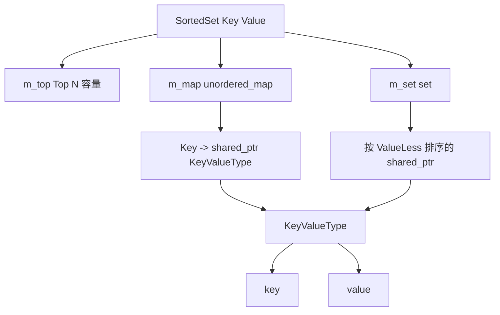
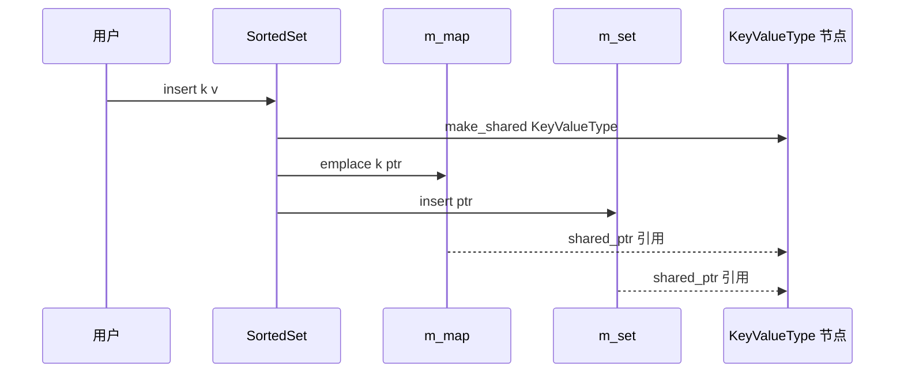
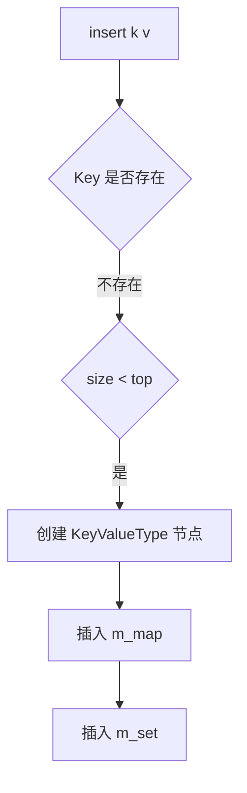
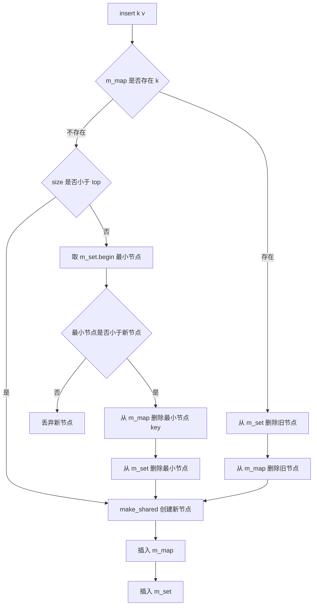

# 1. 背景与动机

## 1.1 排行榜容器要解决的问题

`SortedSet<Key, Value>` 是一个用于维护 **Top N 排行榜** 的模板容器。

它的核心需求不是简单存储元素，而是同时满足三类操作：

| 需求 | 说明 | 典型操作 |
|---|---|---|
| **按 Key 快速查询** | 根据玩家 ID、用户 ID、对象 ID 查找记录 | `find(k)` |
| **按 Value 有序排名** | 根据分数、权重、积分排序 | `begin()`、`get_rank(k)` |
| **限制 Top N 容量** | 只保留排名靠前的前 N 条记录 | `insert(k, v)` 时淘汰最低值 |

如果只使用 `std::unordered_map`：

```cpp
std::unordered_map<Key, Value> map;
```

可以做到按 Key 快速查询，但无法天然按 Value 排序。

如果只使用 `std::set`：

```cpp
std::set<Record> set;
```

可以做到有序排序，但按 Key 查找需要遍历，无法做到平均 $O(1)$。

因此，`SortedSet` 使用了 **双索引结构**：

```cpp
std::unordered_map<key_type, key_value_ptr> m_map;
std::set<key_value_ptr, ValueLess> m_set;
```

> [!summary]
> `SortedSet` 的核心思想是：**用 `unordered_map` 负责按 Key 查找，用 `set` 负责按 Value 排序，两者共同引用同一条排行榜记录。**

## 1.2 适用场景

| 场景 | Key | Value |
|---|---|---|
| **玩家排行榜** | 玩家 ID | 分数、战力、等级 |
| **热度榜** | 内容 ID | 点击量、点赞数、权重 |
| **任务优先级榜** | 任务 ID | 优先级、权重 |
| **服务器监控** | 连接 ID、用户 ID | 流量、延迟、请求数 |
| **缓存淘汰候选集** | 缓存 Key | 访问频率、时间戳 |

> [!tip]
> 可以将 `SortedSet` 理解为：**一个只关心前 N 名的轻量级排行榜容器**。它不是通用数据库索引，也不是完整的 order-statistics tree。

---

# 2. 核心概念

## 2.1 容器定义

当前实现位于：

```cpp
src/rank/include/sorted_set.hpp
```

核心模板定义：

```cpp
namespace sky::rank {

template <typename Key, typename Value>
class SortedSet {
 public:
  using key_type = Key;
  using value_type = Value;
  using size_type = std::size_t;
};

}  // namespace sky::rank
```

模板参数含义：

| 参数 | 含义 | 示例 |
|---|---|---|
| `Key` | 唯一标识一条记录 | 玩家 ID、字符串账号、对象 ID |
| `Value` | 用于排序的值 | 分数、积分、权重、时间戳 |

示例：

```cpp
sky::rank::SortedSet<int, int> rank(100);
```

含义：

```text
Key   = int
Value = int
最多保留前 100 条记录
```

## 2.2 一条记录的表示：KeyValueType

`SortedSet` 内部用 `KeyValueType` 表示一条完整排行榜记录：

```cpp
struct KeyValueType {
  key_type key;
  value_type value;

  explicit KeyValueType(const key_type &k, const value_type &v) : key(k), value(v) {}
};
```

它的意义是把：

```text
Key + Value
```

组合成一条记录。

例如：

```cpp
rank.insert(1001, 9800);
```

内部对应：

```cpp
KeyValueType{1001, 9800}
```

也就是：

```text
key   = 1001
value = 9800
```

> [!info]
> `KeyValueType` 本质上类似 `std::pair<Key, Value>`，但使用 `key` 和 `value` 作为成员名比 `first` 和 `second` 更适合业务代码，可读性更高。

## 2.3 为什么 KeyValueType 里也要保存 key

`m_map` 的 key 已经是 `Key`：

```cpp
std::unordered_map<key_type, key_value_ptr> m_map;
```

看起来 `KeyValueType` 里再保存一次 `key` 有些重复：

```cpp
struct KeyValueType {
  key_type key;
  value_type value;
};
```

但这是必要的。

原因是 `m_set` 里只保存节点指针：

```cpp
std::set<key_value_ptr, ValueLess> m_set;
```

当从 `m_set` 遍历排行榜时，必须知道这一条分数属于哪个 Key：

```cpp
for (const auto &item : rank) {
  std::cout << item->key << " " << item->value << "\n";
}
```

如果 `KeyValueType` 只保存 `value`，则 `m_set` 只能排序分数，却无法知道分数属于谁。

> [!summary]
> `m_map` 的 key 用于查找；`KeyValueType::key` 用于让 `m_set` 中的排序节点仍然携带身份信息。

## 2.4 shared_ptr 节点指针

当前实现使用：

```cpp
using key_value_ptr = std::shared_ptr<KeyValueType>;
```

两个核心容器都保存这个指针：

```cpp
std::unordered_map<key_type, key_value_ptr> m_map;
std::set<key_value_ptr, ValueLess> m_set;
```

也就是说，`m_map` 和 `m_set` 指向同一个 `KeyValueType` 对象：

```text
m_map[key] --------+
                  |
                  v
          KeyValueType{key, value}
                  ^
                  |
m_set ------------+
```

这样可以避免 `m_map` 和 `m_set` 各自保存一份独立记录。

---

# 3. 架构设计

## 3.1 双索引结构

`SortedSet` 的核心架构如下：



三个核心成员：

```cpp
size_type m_top;
std::unordered_map<key_type, key_value_ptr> m_map;
std::set<key_value_ptr, ValueLess> m_set;
```

| 成员 | 职责 | 复杂度 |
|---|---|---|
| `m_top` | 限制最多保留多少条记录 | $O(1)$ |
| `m_map` | 根据 Key 快速查找节点 | 平均 $O(1)$ |
| `m_set` | 根据 Value 有序排序 | 插入/删除 $O(\log n)$ |

## 3.2 排序规则

比较器：

```cpp
struct ValueLess {
  bool operator()(const key_value_ptr &left, const key_value_ptr &right) const {
    if (left->value != right->value)
      return left->value < right->value;

    return left->key < right->key;
  }
};
```

排序规则：

1. 先按 `value` 升序排序。
2. 如果 `value` 相同，再按 `key` 升序排序。

也就是按照：

```text
(value, key)
```

升序排列。

例如：

```text
{key=1, value=100}
{key=2, value=300}
{key=3, value=200}
```

在 `m_set` 内部的顺序是：

```text
{1, 100}
{3, 200}
{2, 300}
```

但排行榜对外需要从大到小遍历，所以 `begin()` 返回反向迭代器：

```cpp
auto begin() const { return m_set.rbegin(); }
auto end() const { return m_set.rend(); }
```

对外遍历顺序变成：

```text
{2, 300}
{3, 200}
{1, 100}
```

> [!tip]
> 记忆方式：`m_set` 内部是“小到大”，`SortedSet` 对外遍历是“大到小”。

## 3.3 生命周期关系

插入一条记录时：

```cpp
key_value_ptr ptr = std::make_shared<KeyValueType>(k, v);
m_map.emplace(k, ptr);
m_set.insert(ptr);
```

生命周期关系：



当 `m_map` 和 `m_set` 都删除对应 `shared_ptr` 后，节点对象自动释放。

## 3.4 核心实现地图

把 `SortedSet` 压缩成一张实现地图，可以看到它并不复杂：**所有操作都围绕“同时维护 `m_map` 和 `m_set`”展开**。

```cpp
template <typename Key, typename Value>
class SortedSet {
 public:
  using key_type = Key;
  using value_type = Value;
  using size_type = std::size_t;

  struct KeyValueType {
    key_type key;
    value_type value;

    explicit KeyValueType(const key_type &k, const value_type &v)
        : key(k), value(v) {}
  };

  using key_value_ptr = std::shared_ptr<KeyValueType>;

  struct ValueLess {
    bool operator()(const key_value_ptr &left,
                    const key_value_ptr &right) const {
      if (left->value != right->value)
        return left->value < right->value;
      return left->key < right->key;
    }
  };

 private:
  static constexpr size_type default_top = 1000;

  size_type m_top;
  std::unordered_map<key_type, key_value_ptr> m_map;
  std::set<key_value_ptr, ValueLess> m_set;
};
```

三条核心不变量：

| 不变量 | 说明 |
|---|---|
| **节点一致性** | `m_map` 与 `m_set` 必须引用同一批 `KeyValueType` 节点 |
| **排序一致性** | 任何影响 `ValueLess` 的字段变化，都必须通过 `erase + insert` 完成 |
| **容量一致性** | `m_set.size()` 不应超过 `m_top`，`size()` 直接以 `m_set` 为准 |

> [!warning]
> 这类双索引容器最怕“一边改了，另一边没改”。只要 `m_map` 和 `m_set` 不再保存同一批节点，后续查询、排名、析构都会变得不可信。

---

# 4. shared_ptr 与堆对象

## 4.1 为什么不能保存栈对象地址

错误示例：

```cpp
void insert(const key_type &k, const value_type &v) {
  KeyValueType node(k, v);
  m_map[k] = &node;
  m_set.insert(&node);
}
```

问题在于：

```text
node 是 insert 函数里的局部变量
insert 返回后 node 被销毁
m_map 和 m_set 中保存的地址变成悬空指针
```

因此，一条记录必须由生命周期更长的对象管理。

当前实现选择将节点分配到堆上：

```cpp
std::make_shared<KeyValueType>(k, v);
```

只要 `m_map` 或 `m_set` 中还有 `shared_ptr` 指向该节点，节点就不会销毁。

> [!warning]
> 不能把函数局部变量地址放进长期存在的容器中。函数返回后，容器中保存的地址会变成悬空指针。

## 4.2 为什么 map 和 set 不直接各保存一份对象

如果写成：

```cpp
std::unordered_map<key_type, KeyValueType> m_map;
std::set<KeyValueType, ValueLess> m_set;
```

则同一条逻辑记录会出现两份物理数据：

```text
m_map[key] ---> KeyValueType{key, value}

m_set      ---> KeyValueType{key, value}
```

这样会带来一致性问题：

| 问题 | 说明 |
|---|---|
| **更新复杂** | 更新 value 时必须同时维护 map 和 set 两份数据 |
| **删除复杂** | 按 Key 删除时，还要在 set 中找到对应旧记录 |
| **状态容易不一致** | 任意一边漏改都会破坏容器语义 |
| **set 不能原地修改排序字段** | 修改 `value` 会破坏 `std::set` 的排序不变量 |

当前实现通过 `shared_ptr` 让两个容器指向同一条节点，减少副本一致性问题。

## 4.3 为什么不用裸指针

可以用裸指针实现共享节点：

```cpp
std::unordered_map<key_type, KeyValueType*> m_map;
std::set<KeyValueType*, ValueLess> m_set;
```

但必须手动管理内存：

```cpp
auto ptr = new KeyValueType(k, v);
delete ptr;
```

风险：

| 风险 | 说明 |
|---|---|
| **内存泄漏** | 忘记 `delete` |
| **悬空指针** | 一边删除节点后，另一边仍保存指针 |
| **异常安全复杂** | 插入 map 成功、插入 set 失败时要回滚 |

`shared_ptr` 的优势是生命周期自动管理：

```text
还有容器引用 -> 节点存活
没有容器引用 -> 节点自动释放
```

## 4.4 shared_ptr 不是唯一方案

`shared_ptr` 简单安全，但不是性能最优。

更轻量的方案是：

```cpp
std::unordered_map<key_type, value_type> m_map;
std::set<std::pair<value_type, key_type>> m_set;
```

含义：

```text
m_map: key -> value
m_set: (value, key) 有序排序
```

删除时：

```cpp
auto it = m_map.find(k);
if (it != m_map.end()) {
  m_set.erase({it->second, k});
  m_map.erase(it);
}
```

对比：

| 方案 | 优点 | 缺点 |
|---|---|---|
| `shared_ptr<KeyValueType>` | 节点共享直观，生命周期自动管理 | 堆分配和引用计数开销 |
| `unique_ptr + raw pointer index` | 所有权清晰，开销较小 | 删除顺序要求严格 |
| `map<Key, Value> + set<pair<Value, Key>>` | 简单高效，无节点堆分配 | map 和 set 仍保存两份轻量数据 |

> [!summary]
> 当前实现选择 `shared_ptr` 是为了让 `m_map` 和 `m_set` 共享同一个节点，降低生命周期管理难度；但对于只有 `{key, value}` 两个字段的排行榜，`map + set<pair>` 往往更轻量。

---

# 5. 核心流程

## 5.1 构造函数

默认构造：

```cpp
SortedSet() : m_top(default_top) {}
```

指定 Top N：

```cpp
explicit SortedSet(const size_type top) : m_top(top == 0 ? default_top : top) {}
```

语义：

| 调用 | 实际容量 |
|---|---|
| `SortedSet<int, int> s;` | `1000` |
| `SortedSet<int, int> s(10);` | `10` |
| `SortedSet<int, int> s(0);` | `1000` |

`top == 0` 时回退到默认值，是为了避免创建一个永远不能插入元素的排行榜。

## 5.2 插入新 Key

核心代码：

```cpp
auto it = m_map.find(k);
if (it == m_map.end()) {
  if (m_set.size() < m_top) {
    add();
  }
}
```

当 Key 不存在且容量未满时，直接插入：

```cpp
key_value_ptr ptr = std::make_shared<KeyValueType>(k, v);
m_map.emplace(k, ptr);
m_set.insert(ptr);
```

流程：



## 5.3 容量满时的淘汰逻辑

当容量已满时：

```cpp
auto min = m_set.begin();
auto ptr = std::make_shared<KeyValueType>(k, v);

if (!ValueLess{}(*min, ptr))
  return;

m_map.erase((*min)->key);
m_set.erase(min);
m_map.emplace(k, ptr);
m_set.insert(ptr);
```

关键点：

```cpp
m_set.begin()
```

指向当前最小元素，因为 `m_set` 内部按升序排序。

判断：

```cpp
if (!ValueLess{}(*min, ptr))
  return;
```

含义：

```text
如果当前最小元素并不小于新元素
说明新元素没有资格进入 Top N
直接丢弃
```

这比只比较 `value` 更严谨，因为排序规则实际是：

```text
(value, key)
```

例如 Top 3 当前为：

```text
m_set 内部升序：
{key=10, value=100}
{key=20, value=200}
{key=30, value=300}
```

此时最小元素是 `{10, 100}`。

| 新元素 | `ValueLess{}(min, new)` | 结果 |
|---|---|---|
| `{40, 50}` | `false` | 分数更低，丢弃 |
| `{5, 100}` | `false` | 分数相同但 key 更小，丢弃 |
| `{40, 100}` | `true` | 分数相同但 key 更大，替换 `{10, 100}` |
| `{40, 150}` | `true` | 分数更高，替换 `{10, 100}` |

这说明当前排行榜的完整排名规则其实是：

```text
value 越大越靠前
value 相同，则 key 越大越靠前
```

> [!warning]
> 如果只写 `if (v < (*min)->value)`，则在 `value` 相同的时候会无条件替换当前最小元素，可能与 `ValueLess` 的完整排序规则不一致。

## 5.4 更新已有 Key

当 Key 已存在时：

```cpp
else {
  m_set.erase(it->second);
  m_map.erase(it);
  add();
}
```

不能直接修改旧节点的 `value`：

```cpp
it->second->value = v;  // 不推荐
```

原因是 `m_set` 的排序依赖 `value`。如果元素已经在 `std::set` 中，直接修改排序字段会破坏 `set` 内部有序性。

正确做法是：

```text
先从 set 删除旧节点
再从 map 删除旧节点
最后重新插入新节点
```

> [!warning]
> `std::set` 中参与排序的字段不能原地修改。要改变排序字段，必须先 erase，再 insert。

## 5.5 删除 Key

删除逻辑：

```cpp
void erase(const key_type &k) {
  auto it = m_map.find(k);
  if (it == m_map.end())
    return;
  m_set.erase(it->second);
  m_map.erase(it);
}
```

删除顺序必须是：

```text
1. 使用 it->second 从 m_set 删除节点
2. 再从 m_map 删除 it
```

不能反过来：

```cpp
m_map.erase(it);
m_set.erase(it->second);  // 错误：it 已经失效
```

因为 `m_map.erase(it)` 会使迭代器 `it` 失效，再访问 `it->second` 是未定义行为。

## 5.6 清空容器

```cpp
void clear() {
  m_map.clear();
  m_set.clear();
}
```

清空后：

```text
size() == 0
find(k) == map_end()
get_rank(k) == 0
```

当 `m_map` 和 `m_set` 中的 `shared_ptr` 都释放后，对应节点会自动析构。

## 5.7 查询排名

```cpp
size_type get_rank(const key_type &k) const {
  if (!m_map.contains(k))
    return 0;

  size_type rank = 0;
  for (auto it = m_set.rbegin(); it != m_set.rend(); ++it) {
    ++rank;
    if ((*it)->key == k)
      return rank;
  }
  return 0;
}
```

逻辑：

1. 先判断 Key 是否存在。
2. 从 `m_set.rbegin()` 开始按大到小遍历。
3. 每经过一个元素，排名加一。
4. 找到目标 Key 后返回排名。
5. 不存在时返回 `0`。

复杂度是 $O(n)$。

> [!info]
> `std::set` 不能直接计算某个元素是第几名。如果需要高频排名查询，需要 order-statistics tree、Fenwick Tree、Segment Tree 或其他增强结构。

> [!warning]
> `m_map.contains(k)` 是 C++20 接口。如果项目编译标准低于 C++20，需要改成 `m_map.find(k) == m_map.end()`。

## 5.8 插入、更新、淘汰的完整数据流



可以把 `insert()` 分成三条路径记忆：

| 路径 | 条件 | 行为 |
|---|---|---|
| **新增未满** | Key 不存在，`size < top` | 直接插入新节点 |
| **新增已满** | Key 不存在，`size == top` | 只有新节点大于当前最小节点才进入榜单 |
| **更新已有** | Key 已存在 | 先删除旧节点，再插入新节点 |

> [!tip]
> 更新已有 Key 时不会重新执行“是否大于当前最小节点”的门槛判断，因为旧节点本来已经在榜内。它的语义更像“修改榜内玩家分数”，而不是“从全量候选池重新选 Top N”。

---

# 6. 移动语义

## 6.1 为什么禁止拷贝

当前代码禁止拷贝：

```cpp
SortedSet(const SortedSet &) = delete;
SortedSet &operator=(const SortedSet &) = delete;
```

原因是 `SortedSet` 内部有共享节点索引。

如果允许默认拷贝，可能出现两个 `SortedSet` 共享同一批 `KeyValueType` 节点，语义不清晰。

禁止拷贝可以明确表达：

```text
SortedSet 是一个拥有内部索引状态的容器，不允许随意复制。
```

## 6.2 移动构造

当前移动构造：

```cpp
SortedSet(SortedSet &&right) noexcept
    : m_top(right.m_top),
      m_map(std::move(right.m_map)),
      m_set(std::move(right.m_set)) {}
```

用途：

```cpp
SortedSet<int, int> a(10);
SortedSet<int, int> b(std::move(a));
```

含义：

```text
b 是新对象
b 直接接管 a 的 map 和 set 资源
a 处于有效但内容未指定的 moved-from 状态
```

## 6.3 为什么 m_top 不用 std::move

`m_top` 是 `std::size_t`，属于简单数值类型。

```cpp
m_top(right.m_top)
```

就足够了。

写成：

```cpp
m_top(std::move(right.m_top))
```

不会带来性能收益，因为整数没有堆内存、缓冲区、文件句柄等可转移资源。

> [!tip]
> `std::move` 本身不移动任何东西，它只是把对象转换成右值引用。真正是否发生资源转移，取决于目标类型的移动构造或移动赋值实现。

## 6.4 移动赋值

当前移动赋值：

```cpp
SortedSet &operator=(SortedSet &&right) noexcept {
  if (this == &right)
    return *this;

  m_top = right.m_top;
  m_map = std::move(right.m_map);
  m_set = std::move(right.m_set);
  return *this;
}
```

用途：

```cpp
SortedSet<int, int> a(10);
SortedSet<int, int> b(20);

b = std::move(a);
```

移动赋值与移动构造的区别：

| 操作 | 示例 | 目标对象状态 |
|---|---|---|
| **移动构造** | `SortedSet b(std::move(a));` | `b` 是新对象 |
| **移动赋值** | `b = std::move(a);` | `b` 已经存在，原资源会被替换 |

## 6.5 为什么移动赋值返回 *this

赋值运算符惯例返回左操作数引用：

```cpp
SortedSet &operator=(SortedSet &&right);
```

因此函数末尾需要：

```cpp
return *this;
```

`this` 是指向当前对象的指针，`*this` 是当前对象本身。

返回引用可以支持链式赋值和表达式继续使用：

```cpp
a = b = c;
```

以及：

```cpp
if ((a = std::move(b)).size() > 0) {
}
```

## 6.6 为什么构造函数没有返回值

构造函数的职责是初始化正在创建的对象。

例如：

```cpp
SortedSet<int, int> b(std::move(a));
```

这里 `b` 已经是正在创建的对象，因此构造函数不需要返回 `b`。

C++ 语法也规定构造函数不能声明返回类型。

> [!summary]
> 移动构造负责“创建新对象并接管资源”；移动赋值负责“替换已有对象的资源并返回当前对象引用”。

---

# 7. const 语义与接口设计

## 7.1 const 成员函数的含义

成员函数末尾的 `const` 表示该函数承诺不修改当前对象：

```cpp
size_type size() const;
auto find(const key_type &k) const;
size_type get_rank(const key_type &k) const;
```

这些函数只读数据，不改变容器内容，因此适合加 `const`。

## 7.2 erase 不能是 const

错误写法：

```cpp
void erase(const key_type &k) const {
  m_set.erase(it->second);
  m_map.erase(it);
}
```

`erase()` 会修改 `m_set` 和 `m_map`，因此不能是 `const`。

编译器会报类似错误：

```text
passing 'const std::set<...>' as 'this' argument discards qualifiers
passing 'const std::unordered_map<...>' as 'this' argument discards qualifiers
```

正确写法：

```cpp
void erase(const key_type &k) {
  auto it = m_map.find(k);
  if (it == m_map.end())
    return;
  m_set.erase(it->second);
  m_map.erase(it);
}
```

> [!warning]
> 只要函数会修改成员变量，就不应该声明为 `const`。`const` 不是“参数不变”，而是“当前对象不变”。

## 7.3 find 参数为什么用 const 引用

推荐写法：

```cpp
auto find(const key_type &k) const { return m_map.find(k); }
```

而不是：

```cpp
auto find(key_type k) const { return m_map.find(k); }
```

原因：

| Key 类型 | 按值传参成本 |
|---|---|
| `int` | 很低 |
| `std::string` | 需要拷贝字符串 |
| 自定义结构体 | 可能拷贝多个字段或资源 |

`const key_type&` 可以避免不必要的拷贝。

---

# 8. explicit 构造函数

## 8.1 explicit 的作用

当前节点构造函数：

```cpp
explicit KeyValueType(const key_type &k, const value_type &v)
    : key(k), value(v) {}
```

`explicit` 会阻止拷贝列表初始化：

```cpp
KeyValueType item = {k, v};  // 不允许
```

但仍允许直接初始化：

```cpp
KeyValueType item(k, v);     // 允许
KeyValueType item{k, v};     // 允许
```

也允许：

```cpp
auto ptr = std::make_shared<KeyValueType>(k, v);
```

## 8.2 explicit 不能防止参数写反

如果 `Key` 和 `Value` 类型相同：

```cpp
SortedSet<int, int>
```

则下面两种写法都能编译：

```cpp
KeyValueType item{k, v};
KeyValueType item{v, k};
```

`explicit` 不能阻止 `{v, k}` 这种顺序错误。

更可靠的方式是使用清晰命名：

```cpp
struct KeyValueType {
  key_type key;
  value_type value;
};
```

而不是：

```cpp
struct KeyValueType {
  key_type first;
  value_type second;
};
```

> [!summary]
> `explicit` 在这里不是必须，但保留也没有问题。它能限制部分隐式初始化，但不能防止同类型参数写反。

---

# 9. 复杂度分析

设当前容器中元素数量为 $n$，且 $n \le top$。

| 操作 | 复杂度 | 原因 |
|---|---|---|
| `find(k)` | 平均 $O(1)$ | `unordered_map` 查找 |
| `insert(k, v)` 新增未满 | 平均 $O(\log n)$ | map 插入 + set 插入 |
| `insert(k, v)` 新增已满 | 平均 $O(\log n)$ | 删除最小值 + 插入新值 |
| `insert(k, v)` 更新已有 Key | 平均 $O(\log n)$ | set 删除旧值 + set 插入新值 |
| `erase(k)` | 平均 $O(\log n)$ | map 查找 + set 删除 |
| `clear()` | $O(n)$ | 清空两个容器 |
| `size()` | $O(1)$ | set 直接返回大小 |
| `get_rank(k)` | $O(n)$ | 需要从大到小遍历 |

空间复杂度：

```text
O(n)
```

其中每条记录会有：

- 一个堆分配的 `KeyValueType` 节点
- `m_map` 中一个哈希节点
- `m_set` 中一个红黑树节点
- 两个容器内各保存一个 `shared_ptr`

## 9.1 性能开销来源

`SortedSet` 的主要成本不在比较函数，而在容器节点与堆分配：

| 开销来源 | 说明 | 影响 |
|---|---|---|
| **`make_shared`** | 每次插入或更新都会创建一个节点 | 有堆分配成本 |
| **`unordered_map` 节点** | 哈希表节点保存 key、value、链表/桶信息 | 额外内存开销 |
| **`set` 节点** | 红黑树节点保存颜色、父子指针 | 插入/删除需旋转与重平衡 |
| **`shared_ptr` 引用计数** | map 和 set 各保存一份智能指针 | 有原子或控制块开销 |
| **`get_rank()` 遍历** | 从第一名线性扫到目标 Key | 高频查询会退化 |

> [!summary]
> 当前实现偏向“清晰、安全、教学友好”，不是极致性能版本。若排行榜规模很大或更新极高频，应优先评估 `shared_ptr`、红黑树节点和线性排名查询的成本。

---

# 10. 易错点

## 10.1 先 erase map 再访问迭代器

错误：

```cpp
m_map.erase(it);
m_set.erase(it->second);
```

原因：

```text
m_map.erase(it) 后 it 已经失效
再访问 it->second 是未定义行为
```

正确：

```cpp
m_set.erase(it->second);
m_map.erase(it);
```

## 10.2 在 set 内原地修改排序字段

错误：

```cpp
it->second->value = new_value;
```

原因：

```text
m_set 的排序依赖 value
原地修改 value 会破坏 set 的有序结构
```

正确：

```cpp
m_set.erase(old_ptr);
m_map.erase(old_it);
insert(k, new_value);
```

## 10.3 erase 被错误声明为 const

错误：

```cpp
void erase(const key_type &k) const;
```

原因：

```text
erase 会修改 m_map 和 m_set
const 成员函数不能修改普通成员变量
```

正确：

```cpp
void erase(const key_type &k);
```

## 10.4 移动构造漏掉 m_set

错误：

```cpp
SortedSet(SortedSet &&right) noexcept
    : m_top(right.m_top),
      m_map(std::move(right.m_map)) {}
```

问题：

```text
新对象 m_map 有数据
新对象 m_set 为空
内部双索引状态不一致
```

正确：

```cpp
SortedSet(SortedSet &&right) noexcept
    : m_top(right.m_top),
      m_map(std::move(right.m_map)),
      m_set(std::move(right.m_set)) {}
```

## 10.5 移动赋值中先拷贝再移动

错误：

```cpp
m_map = right.m_map;
m_map = std::move(right.m_map);
```

第一行是多余拷贝，会浪费性能。

正确：

```cpp
m_map = std::move(right.m_map);
```

## 10.6 include 不完整

当前头文件使用了：

| 代码 | 需要头文件 |
|---|---|
| `std::size_t` | `<cstddef>` |
| `std::shared_ptr`、`std::make_shared` | `<memory>` |
| `std::set` | `<set>` |
| `std::unordered_map` | `<unordered_map>` |
| `std::move` | `<utility>` |

推荐显式包含，不依赖其他头文件间接包含。

## 10.7 对外暴露 shared_ptr 后被修改 value

当前遍历接口返回的是 `std::set` 的反向迭代器，迭代出来的元素类型是 `shared_ptr<KeyValueType>`：

```cpp
for (const auto &item : rank) {
  item->value = 999999;  // 语法上可能成立，但会破坏 m_set 排序
}
```

即使 `begin() const` 是 const 成员函数，`const` 限制的是容器对象本身，不代表 `shared_ptr` 指向的 `KeyValueType` 不可变。

后果：

```text
m_set 的红黑树结构仍按旧 value 排列
节点内部 value 却被外部改成新值
排序不变量被破坏
```

规避方式：

- 对外返回只读视图，而不是直接暴露 `shared_ptr<KeyValueType>`
- 将节点指针类型改为 `std::shared_ptr<const KeyValueType>` 的只读接口
- 提供 `update(k, v)` 统一修改入口，内部执行 `erase + insert`

> [!warning]
> 只要字段参与 `std::set` 排序，就不应该允许外部绕过容器直接修改它。

## 10.8 Key 和 Value 必须可比较

`ValueLess` 内部使用：

```cpp
left->value < right->value;
left->key < right->key;
```

因此模板参数需要满足：

| 类型 | 要求 |
|---|---|
| `Key` | 可哈希、可相等比较、可小于比较 |
| `Value` | 可小于比较、可不等比较 |

对应原因：

| 表达式 | 依赖 |
|---|---|
| `unordered_map<key_type, ...>` | `std::hash<Key>` 与 `operator==` |
| `left->key < right->key` | `Key` 支持严格弱序 |
| `left->value != right->value` | `Value` 支持不等比较 |
| `left->value < right->value` | `Value` 支持严格弱序 |

> [!tip]
> 如果业务 Key 是复杂结构体，通常需要自定义 `std::hash<Key>`、`operator==`，并提供稳定的 `operator<` 作为同分排序规则。

---

# 11. 工程实践建议

## 11.1 当前实现适合的规模

当前 `SortedSet` 适合：

- Top N 容量不太大
- 插入、更新、删除较频繁
- 查询某个 Key 是否存在较频繁
- 查询排名不是极端高频

如果 `get_rank()` 非常高频，当前 $O(n)$ 的排名查询会成为瓶颈。

## 11.2 可考虑的接口改进

| 当前接口 | 问题 | 可选改进 |
|---|---|---|
| `find()` 返回 map 迭代器 | 暴露内部实现 | 提供 `contains()`、`get()` |
| `map_end()` | 调用者需要知道内部是 map | 隐藏内部容器类型 |
| 遍历返回 `shared_ptr` | 暴露节点指针 | 返回只读视图或自定义 iterator |
| `get_rank()` 线性遍历 | 高频时性能不足 | 使用支持 order statistic 的结构 |
| `insert()` 同时承担新增与更新 | 语义略重 | 拆分 `insert_or_assign()` / `try_insert()` |
| Top N 同分按 Key 排序 | 规则隐含在比较器中 | 文档化 tie-breaker 或允许自定义比较器 |

## 11.3 可考虑的内部实现改进

若追求更清晰的所有权模型，可以让 `m_map` 拥有节点，`m_set` 只保存非拥有指针：

```cpp
std::unordered_map<key_type, std::unique_ptr<KeyValueType>> m_map;
std::set<KeyValueType*, ValueLess> m_set;
```

这种方案减少引用计数开销，但删除时必须非常小心：

```text
先从 m_set 删除裸指针
再从 m_map 删除 unique_ptr
```

否则 `m_set` 中会留下悬空指针。

## 11.4 是否需要 default 移动函数

当前手写移动构造和移动赋值是可以的。

如果没有特殊资源管理，也可以考虑：

```cpp
SortedSet(SortedSet &&) noexcept = default;
SortedSet &operator=(SortedSet &&) noexcept = default;
```

优点：

- 不容易漏掉成员
- 代码更短
- 语义更清晰

但手写版本便于学习移动语义。

## 11.5 是否继续使用 shared_ptr

如果 `KeyValueType` 以后会扩展为复杂节点，例如：

```cpp
struct KeyValueType {
  key_type key;
  value_type value;
  std::string name;
  int level;
  std::vector<int> history;
};
```

则共享节点模型更有意义。

如果节点始终只有 `{key, value}`，则可以考虑更轻量的实现：

```cpp
std::unordered_map<key_type, value_type> m_map;
std::set<std::pair<value_type, key_type>> m_set;
```

---

# 12. 测试用例设计

## 12.1 示例测试目录

当前示例测试位于：

```text
src/rank/examples/sorted_set_example.cpp
```

CMake 目标：

```text
sorted_set_example
```

## 12.2 应覆盖的行为

| 测试点 | 验证内容 |
|---|---|
| 插入排序 | 遍历顺序是否从大到小 |
| Top N 淘汰 | 低分元素是否被拒绝或淘汰 |
| 更新已有 Key | 旧节点是否被删除，新 value 是否生效 |
| 删除 Key | `m_map` 和 `m_set` 是否同时删除 |
| 删除不存在 Key | 是否安全无副作用 |
| 清空容器 | `size()`、`find()`、`get_rank()` 是否正确 |
| 相同 Value | 是否按 Key 作为 tie-breaker |
| 移动构造 | 移动后新对象索引是否一致 |
| 移动赋值 | 旧资源是否被替换，目标对象是否正确 |

## 12.3 构建命令

在 CLion 工具链环境中可以构建：

```bash
"C:\Program Files\JetBrains\CLion 2026.1.3\bin\cmake\win\x64\bin\cmake.exe" --build D:\Dev\NetworkProgramming\cmake-build-debug --target sorted_set_example -j 10
```

如果使用普通 CMake：

```bash
cmake -S . -B build
cmake --build build --target sorted_set_example
ctest --test-dir build -R sorted_set_example --output-on-failure
```

---

# 13. 总结

## 13.1 核心结论

> [!summary]
> `SortedSet` 是一个基于 `unordered_map + set` 的 Top N 排行榜容器。`unordered_map` 负责按 Key 快速查找，`set` 负责按 Value 有序排序，两者通过 `shared_ptr<KeyValueType>` 指向同一条记录。

核心结构：

```text
SortedSet = Top N 容量限制
          + unordered_map<Key, shared_ptr<Node>> 快速查找
          + set<shared_ptr<Node>, ValueLess> 有序排名
```

核心不变量：

```text
m_map 和 m_set 必须保存同一批节点
任何插入、更新、删除都必须同时维护两个容器
```

## 13.2 复习清单

- [ ] `KeyValueType` 为什么要同时保存 `key` 和 `value`
- [ ] 为什么不能把局部变量地址放进 `m_map` 和 `m_set`
- [ ] `shared_ptr` 在双索引结构中的作用是什么
- [ ] `m_set` 内部为什么是升序，而对外遍历为什么是降序
- [ ] 更新已有 Key 时为什么不能原地修改 `value`
- [ ] 删除时为什么必须先删 `m_set`，再删 `m_map`
- [ ] `erase()` 为什么不能是 `const`
- [ ] 移动构造和移动赋值的区别是什么
- [ ] 为什么 `m_top` 不需要 `std::move`
- [ ] 为什么移动赋值要 `return *this`
- [ ] `explicit KeyValueType(...)` 能限制什么，不能限制什么
- [ ] 当前实现的 `get_rank()` 为什么是 $O(n)$

## 13.3 一句话记忆

> [!tip]
> `SortedSet` 可以记成：**一个节点，两套索引；map 管查找，set 管排名；更新先删旧节点，再插新节点。**
