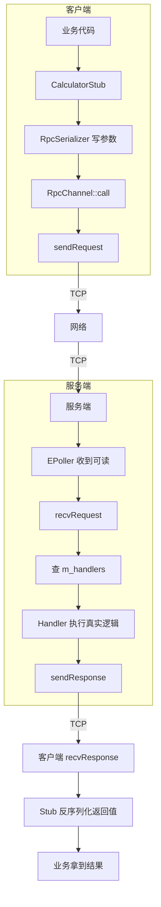
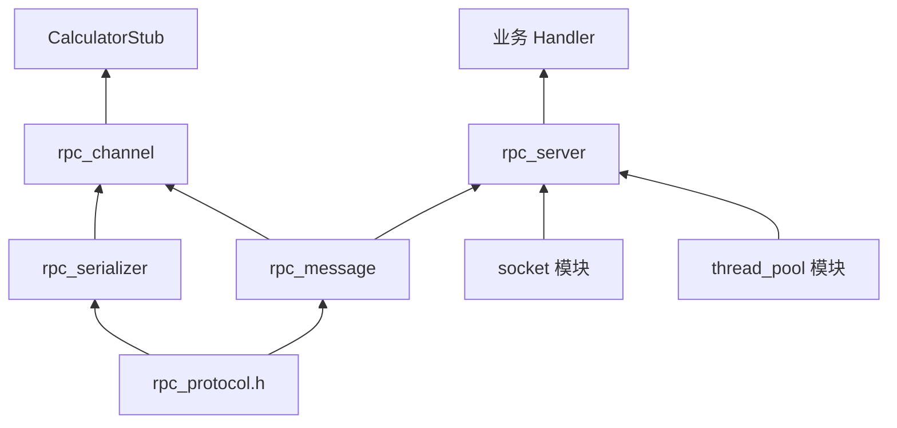
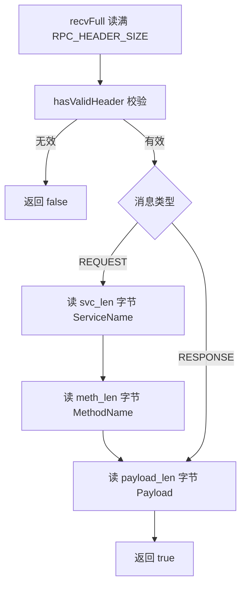
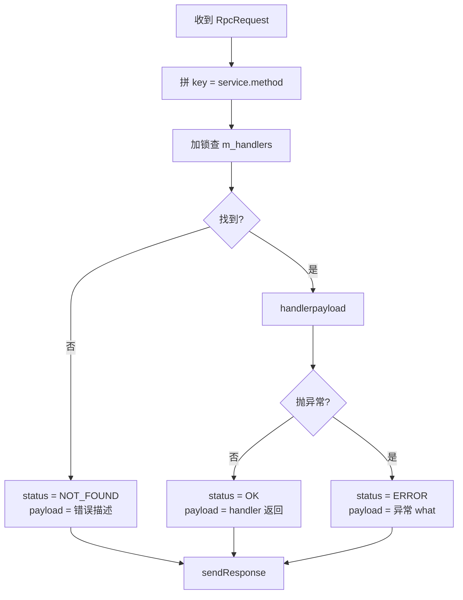
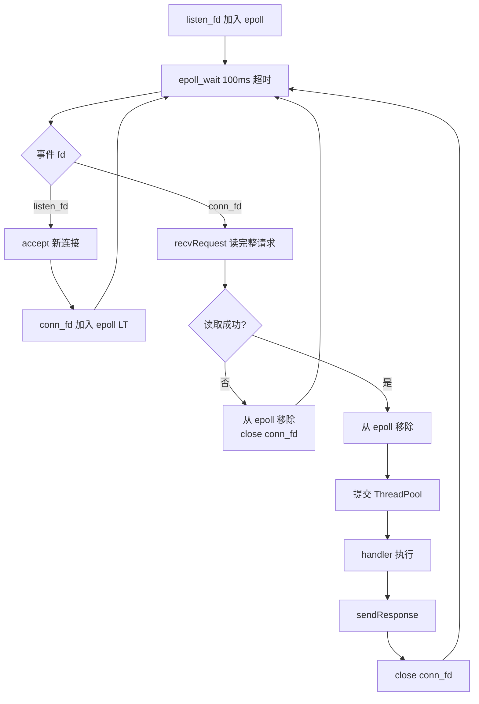
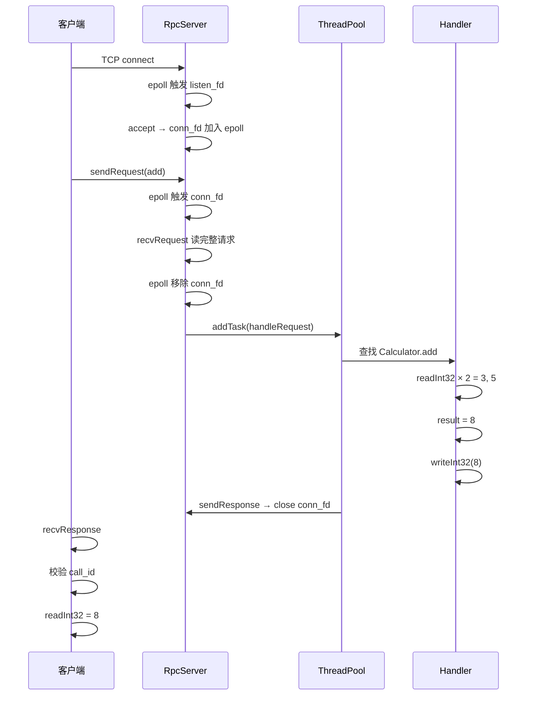
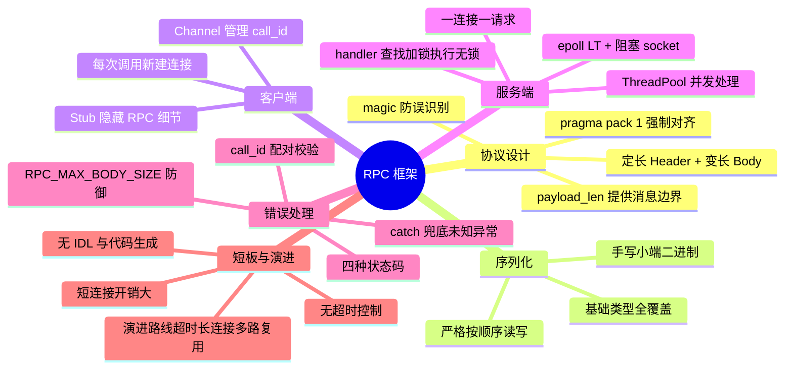

# 1. 背景与动机

## 1.1 本地调用与远程调用的鸿沟


| 维度         | 本地调用       | 远程调用                          |
| ------------ | -------------- | --------------------------------- |
| **参数传递** | 寄存器 / 栈    | 必须序列化为字节流经网络传输      |
| **寻址**     | 编译期符号地址 | 运行期`service.method` 字符串查找 |
| **调用语义** | 同步、必定返回 | 可能丢包、超时、崩溃              |
| **错误模型** | 异常 / 返回码  | 网络错误 + 业务错误双重叠加       |
| **跨语言**   | 同一编译单元   | 需要中立协议                      |

> [!warning]
> 网络不可靠：TCP 仅保证字节流顺序，不保证消息边界、不保证对端存活。任何 RPC 框架都必须显式处理粘包/半包、超时、连接断开。

## 1.2 RPC 的核心思想

> **RPC（Remote Procedure Call）让远程调用在形式上看起来与本地调用一致，背后由框架完成"序列化 + 网络传输 + 服务端分发 + 结果返回"。**

```cpp
// 本地调用
int result = add(3, 5);

// RPC：形式上几乎一样
CalculatorStub calc("127.0.0.1", 8080);
int result = calc.add(3, 5);
```

`calc.add(3, 5)` 这行代码背后实际发生的事：

1. `CalculatorStub::add` 把 `3` 和 `5` 序列化为二进制参数。
2. `RpcChannel` 建立 TCP 连接。
3. 客户端发送 RPC Request（含服务名 `Calculator`、方法名 `add`、参数 payload）。
4. 服务端根据 `Calculator.add` 查找已注册的 handler。
5. handler 反序列化参数、执行真实逻辑、得到结果 `8`。
6. 服务端把 `8` 序列化为响应 payload 发回客户端。
7. 客户端反序列化响应，返回给调用方。

## 1.3 本模块定位

本目录实现一个**轻量级教学 RPC 框架**，目标是覆盖 RPC 最核心的环节：

- 二进制协议 + 定长 Header 解决粘包/半包
- 手写序列化器覆盖基础类型
- Stub / Channel / Server 三层分离
- `call_id` 配对请求与响应
- 状态码 + 错误 payload 表达失败
- epoll + ThreadPool 服务端模型

> [!info]
> 本框架**不是工业级实现**，省略了长连接复用、超时、IDL、熔断等生产能力，详见 [14. 当前实现的边界](#14-当前实现的边界)。

---

# 2. 核心概念

## 2.1 RPC 定义

> **RPC（远程过程调用）**：一种允许程序调用另一地址空间（通常为另一台机器）上函数的协议，框架负责把"调用 + 参数"封送为网络消息，把"返回值"封送回调用方。

## 2.2 关键术语


| 术语                 | 含义                                                                       |
| -------------------- | -------------------------------------------------------------------------- |
| **Stub（存根）**     | 客户端侧的本地代理，把方法调用翻译成 RPC 请求                              |
| **Skeleton（骨架）** | 服务端侧的派发器，把 RPC 请求翻译成本地函数调用（本框架合并入`RpcServer`） |
| **Channel（通道）**  | 负责请求/响应的网络收发                                                    |
| **Header（协议头）** | 定长字段，承载魔数、版本、长度等元信息                                     |
| **Payload（载荷）**  | 序列化后的参数或返回值，变长                                               |
| **call_id**          | 单调递增的调用 ID，用于请求/响应配对                                       |
| **Handler**          | 服务端注册的处理函数，输入字节、输出字节                                   |
| **Service / Method** | 二级命名空间，定位到具体处理函数                                           |

## 2.3 模块分层


| 层                | 组件                                                       | 职责                           |
| ----------------- | ---------------------------------------------------------- | ------------------------------ |
| **业务层**        | `CalculatorStub` / 用户 handler                            | 真实业务逻辑                   |
| **Stub 层**       | `CalculatorStub`                                           | 把方法调用打包成 RPC 请求      |
| **Channel 层**    | `RpcChannel`                                               | 连接管理、`call_id` 分配、收发 |
| **Message 层**    | `RpcRequest` / `RpcResponse` / `sendXxx` / `recvXxx`       | 协议封包/拆包                  |
| **Serializer 层** | `RpcSerializer`                                            | 类型 ↔ 字节流互转             |
| **Protocol 层**   | `RpcHeader` / 常量 / 枚举                                  | 协议元数据                     |
| **网络层**        | `ServerSocket` / `EPoller` / `ClientSocket` / `ThreadPool` | 已有基础设施                   |

> [!tip]
> 记忆技巧：**Protocol 定义"长什么样"，Message 定义“怎么发”，Serializer 定义“怎么编码”，Channel/Server 定义“谁来收发”。**

---

# 3. 架构设计

## 3.1 整体架构



## 3.2 目录结构

```text
src/rpc
├── CMakeLists.txt
├── README.md
├── include/rpc
│   ├── rpc_protocol.h    # 协议头、魔数、版本、状态码
│   ├── rpc_message.h     # RpcRequest/RpcResponse 和收发函数声明
│   ├── rpc_serializer.h  # 简易二进制序列化器
│   ├── rpc_channel.h     # 客户端调用通道
│   └── rpc_server.h      # 服务端注册和分发
├── impl
│   ├── rpc_message.cpp
│   ├── rpc_serializer.cpp
│   ├── rpc_channel.cpp
│   └── rpc_server.cpp
├── tests
│   ├── test_rpc_serializer.cpp
│   ├── test_rpc_message.cpp
│   └── test_rpc_channel_server.cpp
└── examples
    ├── rpc_calculator_server.cpp
    ├── rpc_calculator_client.cpp
    └── rpc_calculator_stub.h
```


| 目录          | 作用                                      |
| ------------- | ----------------------------------------- |
| `include/rpc` | 公共头文件，外部使用方只需`#include` 这些 |
| `impl`        | 实现文件，编译为静态库`rpc`               |
| `tests`       | 自动化测试，使用 GoogleTest 风格断言      |
| `examples`    | 手动示例，演示完整调用链                  |

## 3.3 模块依赖关系



> [!info]
> `rpc_protocol.h` 是最底层依赖，仅含常量与结构体定义，无副作用，被所有其他模块包含。

---

# 4. 协议格式

## 4.1 整体结构

RPC 传输的数据由两部分组成：

```text
+--------------------+-------------------+
|   定长 Header      |   变长 Body       |
|   RPC_HEADER_SIZE  |   依长度字段而定  |
+--------------------+-------------------+
```

协议定义位于 [rpc_protocol.h](include/rpc/rpc_protocol.h)。

## 4.2 RpcHeader 字段

```cpp
#pragma pack(push, 1)  // 禁止字节对齐，确保跨平台一致
struct RpcHeader {
  uint32_t magic;        // 魔数：0x52504330 ('RPC0')
  uint8_t  version;      // 协议版本：1
  uint8_t  msg_type;     // 0 = 请求，1 = 响应
  uint8_t  status;       // 响应状态码（请求中固定为 0）
  uint32_t call_id;      // 调用 ID，配对请求与响应
  uint32_t svc_len;      // 服务名长度（仅请求使用）
  uint32_t meth_len;     // 方法名长度（仅请求使用）
  uint32_t payload_len;  // 载荷字节数
};
#pragma pack(pop)
```


| 字段          | 类型       | 含义                              | 请求 | 响应    |
| ------------- | ---------- | --------------------------------- | ---- | ------- |
| `magic`       | `uint32_t` | 协议魔数`0x52504330`，识别 RPC 包 | ✔   | ✔      |
| `version`     | `uint8_t`  | 协议版本，当前`1`                 | ✔   | ✔      |
| `msg_type`    | `uint8_t`  | `0` = 请求，`1` = 响应            | ✔   | ✔      |
| `status`      | `uint8_t`  | 响应状态，请求中固定`0`           | —   | ✔      |
| `call_id`     | `uint32_t` | 调用 ID，配对请求与响应           | ✔   | ✔      |
| `svc_len`     | `uint32_t` | 服务名长度                        | ✔   | 必须`0` |
| `meth_len`    | `uint32_t` | 方法名长度                        | ✔   | 必须`0` |
| `payload_len` | `uint32_t` | 载荷字节数                        | ✔   | ✔      |

> [!warning]
> `#pragma pack(push, 1)` 强制 1 字节对齐。若去掉，编译器会在 `uint8_t` 后插入填充字节，导致 `sizeof(RpcHeader)` 不再是 23 字节，跨编译器/跨平台互通会出错。

字段大小合计：`4 + 1 + 1 + 1 + 4 + 4 + 4 + 4 = 23` 字节，因此 `RPC_HEADER_SIZE = sizeof(RpcHeader) = 23`。这里的 Header 大小只包含定长 `RpcHeader`，不包含后面的 `ServiceName`、`MethodName` 和 `Payload`。

## 4.3 魔数构造

```cpp
constexpr uint32_t RPC_MAGIC =
    ('R' << 24) |   // 0x52
    ('P' << 16) |   // 0x50
    ('C' << 8 ) |   // 0x43
    ('0');          // 0x30
// 结果：0x52504330
```

> [!tip]
> 魔数作用：当接收方读到 `magic != RPC_MAGIC` 时，可以立即判定这不是合法 RPC 包，避免把垃圾数据当作协议解析。

## 4.4 请求包格式

```text
+------------------+--------------------+----------------------+--------------------+
|   RpcHeader      | ServiceName bytes  | MethodName bytes     | Payload bytes      |
|   23 字节定长    | svc_len 字节       | meth_len 字节        | payload_len 字节   |
+------------------+--------------------+----------------------+--------------------+
```

例如调用 `Calculator.add(3, 5)`：

```text
service_name = "Calculator"   // svc_len  = 10
method_name  = "add"          // meth_len = 3
payload      = int32(3) + int32(5)  // payload_len = 8
```

## 4.5 响应包格式

```text
+------------------+--------------------+
|   RpcHeader      | Payload bytes      |
|   23 字节定长    | payload_len 字节   |
+------------------+--------------------+
```

成功时：

```text
status  = OK (0)
payload = int32(8)
```

失败时：

```text
status  = ERROR / NOT_FOUND / BAD_REQUEST
payload = RpcSerializer.writeString(error_message)
```

> [!info]
> 响应中 `svc_len` 和 `meth_len` 必须为 `0`。接收方在 `hasValidHeader` 中显式校验，避免被请求包伪装成响应。

---

# 5. 序列化器

序列化器位于 [rpc_serializer.h](include/rpc/rpc_serializer.h) / [rpc_serializer.cpp](impl/rpc_serializer.cpp)。

## 5.1 为什么需要序列化

**网络只能传输字节**，不能直接传输 C++ 对象。序列化解决“对象 ↔ 字节流”双向映射：

- **序列化（write）**：把内存中的对象按规则编码成字节流
- **反序列化（read）**：从字节流按规则重建对象

## 5.2 支持类型与编码


| 类型          | 编码方式                  | 字节数 |
| ------------- | ------------------------- | ------ |
| `int8_t`      | 1 字节                    | 1      |
| `int32_t`     | 4 字节小端                | 4      |
| `uint32_t`    | 4 字节小端                | 4      |
| `int64_t`     | 8 字节小端                | 8      |
| `double`      | 8 字节 IEEE 754           | 8      |
| `bool`        | `0` 或 `1`                | 1      |
| `std::string` | `uint32_t(length)` + 内容 | 4 + N  |

> [!warning]
> 本序列化器**采用主机小端序**，未做网络字节序转换。仅在同样小端的机器间互通安全；若跨大小端机器需补充 `htonl/ntohl`。

## 5.3 关键接口

```cpp
class RpcSerializer {
 public:
  // 写入
  void writeInt32(int32_t v);
  void writeString(const std::string &v);
  void writeRaw(const char *data, size_t len);
  const std::vector<char> &data() const;

  // 读取
  void reset(const std::vector<char> &data);
  int32_t readInt32();
  std::string readString();
  size_t remaining() const;
};
```

## 5.4 写入与读取示例

```cpp
// 写参数
RpcSerializer params;
params.writeInt32(3);
params.writeInt32(5);

// 读参数
RpcSerializer reader;
reader.reset(params.data());
int a = reader.readInt32();  // 3
int b = reader.readInt32();  // 5
```

> [!warning]
> ==写入顺序与读取顺序必须严格一致==。写的是 `int32, int32`，读时也必须按 `int32, int32` 读；否则数据错位、解析失败。

## 5.5 write/read 字节布局示意

`RpcSerializer` 内部只有两个核心状态：

```text
m_buffer   : std::vector<char>，保存已经序列化好的字节
m_read_pos : size_t，反序列化时的当前读取位置
```

### 5.5.1 写入两个 int32

代码：

```cpp
RpcSerializer params;
params.writeInt32(3);
params.writeInt32(5);
```

初始状态：

```text
m_buffer = []
```

执行 `writeInt32(3)` 后，`int32_t` 占 4 字节，**小端序**写入：

```text
m_buffer
+---------+---------+---------+---------+
| 0x03    | 0x00    | 0x00    | 0x00    |
+---------+---------+---------+---------+
  index 0   index 1   index 2   index 3

含义：int32(3)
```

执行 `writeInt32(5)` 后：

```text
m_buffer
+---------+---------+---------+---------+---------+---------+---------+---------+
| 0x03    | 0x00    | 0x00    | 0x00    | 0x05    | 0x00    | 0x00    | 0x00    |
+---------+---------+---------+---------+---------+---------+---------+---------+
  index 0   index 1   index 2   index 3   index 4   index 5   index 6   index 7
    \_______________________________/       \_______________________________/
             int32(3)                                  int32(5)
```

此时 `params.data()` 返回的就是这 8 个字节。RPC 请求中的 `payload_len` 会等于 `8`。

### 5.5.2 读取两个 int32

代码：

```cpp
RpcSerializer reader;
reader.reset(params.data());
int a = reader.readInt32();
int b = reader.readInt32();
```

执行 `reset` 后：

```text
m_buffer
+---------+---------+---------+---------+---------+---------+---------+---------+
| 0x03    | 0x00    | 0x00    | 0x00    | 0x05    | 0x00    | 0x00    | 0x00    |
+---------+---------+---------+---------+---------+---------+---------+---------+
  index 0   index 1   index 2   index 3   index 4   index 5   index 6   index 7
  ^
  |
  m_read_pos = 0
```

第一次执行 `readInt32()`：

```text
读取前：

+---------+---------+---------+---------+---------+---------+---------+---------+
| 0x03    | 0x00    | 0x00    | 0x00    | 0x05    | 0x00    | 0x00    | 0x00    |
+---------+---------+---------+---------+---------+---------+---------+---------+
^
|
m_read_pos = 0

readInt32 读取 4 字节：

+---------+---------+---------+---------+
| 0x03    | 0x00    | 0x00    | 0x00    |  => int32(3)
+---------+---------+---------+---------+

读取后：

+---------+---------+---------+---------+---------+---------+---------+---------+
| 0x03    | 0x00    | 0x00    | 0x00    | 0x05    | 0x00    | 0x00    | 0x00    |
+---------+---------+---------+---------+---------+---------+---------+---------+
                                        ^
                                        |
                                        m_read_pos = 4
```

第二次执行 `readInt32()`：

```text
读取前：

+---------+---------+---------+---------+---------+---------+---------+---------+
| 0x03    | 0x00    | 0x00    | 0x00    | 0x05    | 0x00    | 0x00    | 0x00    |
+---------+---------+---------+---------+---------+---------+---------+---------+
                                        ^
                                        |
                                        m_read_pos = 4

readInt32 读取 4 字节：

                                        +---------+---------+---------+---------+
                                        | 0x05    | 0x00    | 0x00    | 0x00    |  => int32(5)
                                        +---------+---------+---------+---------+

读取后：

+---------+---------+---------+---------+---------+---------+---------+---------+
| 0x03    | 0x00    | 0x00    | 0x00    | 0x05    | 0x00    | 0x00    | 0x00    |
+---------+---------+---------+---------+---------+---------+---------+---------+
                                                                                ^
                                                                                |
                                                                                m_read_pos = 8
```

此时：

```text
a = 3
b = 5
remaining() = m_buffer.size() - m_read_pos = 8 - 8 = 0
```

### 5.5.3 写入 string

字符串是变长数据，不能像 `int32_t` 那样只靠固定字节数读取。因此 `writeString` 会先写入 4 字节长度，再写入字符串内容。

代码：

```cpp
RpcSerializer writer;
writer.writeString("hello");
```

实际写入过程：

```text
writeString("hello")
  |
  |-- writeUint32(5)       // 先写字符串长度，uint32_t，占 4 字节
  |
  `-- writeRaw("hello", 5) // 再写字符串内容，占 5 字节
```

最终字节布局：

```text
m_buffer
+---------+---------+---------+---------+---------+---------+---------+---------+---------+
| 0x05    | 0x00    | 0x00    | 0x00    | 0x68    | 0x65    | 0x6c    | 0x6c    | 0x6f    |
+---------+---------+---------+---------+---------+---------+---------+---------+---------+
  index 0   index 1   index 2   index 3   index 4   index 5   index 6   index 7   index 8
    \_______________________________/       \_________________________________________/
          uint32_t length = 5                         string bytes = "hello"

0x68 = 'h'
0x65 = 'e'
0x6c = 'l'
0x6c = 'l'
0x6f = 'o'
```

### 5.5.4 读取 string

代码：

```cpp
RpcSerializer reader;
reader.reset(writer.data());
std::string s = reader.readString();
```

读取前：

```text
m_buffer
+---------+---------+---------+---------+---------+---------+---------+---------+---------+
| 0x05    | 0x00    | 0x00    | 0x00    | 0x68    | 0x65    | 0x6c    | 0x6c    | 0x6f    |
+---------+---------+---------+---------+---------+---------+---------+---------+---------+
^
|
m_read_pos = 0
```

`readString()` 第一步会调用 `readUint32()`，读取字符串长度：

```text
读取长度字段：

+---------+---------+---------+---------+
| 0x05    | 0x00    | 0x00    | 0x00    |  => uint32_t len = 5
+---------+---------+---------+---------+

m_read_pos 从 0 移动到 4
```

此时 buffer 状态：

```text
+---------+---------+---------+---------+---------+---------+---------+---------+---------+
| 0x05    | 0x00    | 0x00    | 0x00    | 0x68    | 0x65    | 0x6c    | 0x6c    | 0x6f    |
+---------+---------+---------+---------+---------+---------+---------+---------+---------+
                                        ^
                                        |
                                        m_read_pos = 4
```

`readString()` 第二步会检查后面是否还有 `len` 个字节：

```cpp
ensureReadable(len); // ensureReadable(5)
```

第三步从当前位置读取 5 字节字符串内容：

```text
读取字符串内容：

                                        +---------+---------+---------+---------+---------+
                                        | 0x68    | 0x65    | 0x6c    | 0x6c    | 0x6f    |  => "hello"
                                        +---------+---------+---------+---------+---------+

m_read_pos 从 4 移动到 9
```

读取完成后：

```text
+---------+---------+---------+---------+---------+---------+---------+---------+---------+
| 0x05    | 0x00    | 0x00    | 0x00    | 0x68    | 0x65    | 0x6c    | 0x6c    | 0x6f    |
+---------+---------+---------+---------+---------+---------+---------+---------+---------+
                                                                                          ^
                                                                                          |
                                                                                          m_read_pos = 9

s = "hello"
remaining() = 0
```

> [!tip]
> `readString()` 中的 `uint32_t len = readUint32();` 读取的是“字符串长度字段”，不是字符串内容。真正的字符串内容在长度字段之后，读取多少字节由 `len` 决定。

### 5.5.5 多字段连续写入时为什么必须按顺序读取

如果连续写入多个不同类型：

```cpp
RpcSerializer writer;
writer.writeInt32(100);
writer.writeString("ok");
writer.writeBool(true);
```

字节布局是：

```text
m_buffer
+---------+---------+---------+---------+---------+---------+---------+---------+---------+---------+---------+
| 0x64    | 0x00    | 0x00    | 0x00    | 0x02    | 0x00    | 0x00    | 0x00    | 0x6f    | 0x6b    | 0x01    |
+---------+---------+---------+---------+---------+---------+---------+---------+---------+---------+---------+
    \_______________________________/       \_______________________________/     \_______________/    \____/
            int32(100)                             uint32_t length = 2                    "ok"         bool(true)
```

正确读取顺序：

```cpp
int32_t code = reader.readInt32();    // 读取 index 0..3
std::string msg = reader.readString(); // 先读 index 4..7 的长度，再读 index 8..9 的内容
bool ok = reader.readBool();           // 读取 index 10
```

如果读取顺序错了，例如一开始就调用 `readString()`：

```text
readString 会把前 4 字节 int32(100) 当成字符串长度：

+---------+---------+---------+---------+
| 0x64    | 0x00    | 0x00    | 0x00    |  => len = 100
+---------+---------+---------+---------+

但后面实际只剩 7 字节，于是 ensureReadable(100) 会抛出 std::out_of_range。
```

这就是“**写入顺序与读取顺序必须严格一致**”的根本原因：序列化后的字节流本身不携带类型信息，读取方只能按约定解释这些字节。

## 5.6 越界保护

读取时通过 `ensureReadable(n)` 检查剩余可读字节：

```cpp
void RpcSerializer::ensureReadable(size_t n) const {
    if (m_read_pos + n > m_buffer.size()) {
        throw std::out_of_range("RpcSerializer: not enough data to read");
    }
}
```

> [!info]
> 越界会抛 `std::out_of_range`，调用方需用 `try/catch` 包裹反序列化代码，否则会终止进程。

---

# 6. 消息收发与粘包处理

## 6.1 TCP 流式传输的困境

TCP 是字节流协议，**不保留消息边界**。客户端一次 `send`，服务端可能：

- 一次只收到半个 Header
- 一次收到 Header 加一半 Body
- 一次收到多个 RPC 包的数据

```text
客户端发送：[Msg1 完整][Msg2 完整][Msg3 完整]
                  ↓ TCP 拆解/合并
服务端收到：[Msg1 半][Msg1 半 + Msg2 全][Msg3 全]
```

## 6.2 Header 的定界作用

> Header 中的长度字段（`svc_len` / `meth_len` / `payload_len`）提供了**消息边界**：接收方先读满 Header，再根据长度字段读满 Body。

接收流程位于 [rpc_message.cpp](impl/rpc_message.cpp)：



## 6.3 `recvFull` 与 `sendFull`

```cpp
static bool recvFull(int fd, char *buf, size_t n) {
    size_t total = 0;
    while (total < n) {
        ssize_t nread = ::recv(fd, buf + total, n - total, 0);
        if (nread < 0 && errno == EINTR) continue;  // 被信号打断，重试
        if (nread <= 0) return false;                // 连接关闭或出错
        total += static_cast<size_t>(nread);
    }
    return true;
}
```

要点：

- **循环读**：直到读满 `n` 字节，应对分片到达
- **EINTR 处理**：被信号打断时继续重试
- **`nread <= 0` 判定**：连接关闭或出错立即返回 `false`
- `sendFull` 同理：循环写直到全部发出

> [!tip]
> `recv` 返回 `0` 表示**对端关闭连接**；返回 `-1` 且 `errno == EINTR` 表示被信号打断（应重试）；其他 `-1` 是真实错误。

## 6.4 Header 合法性校验

`hasValidHeader` 在读取后立即校验，避免异常包进入业务逻辑：

```cpp
static bool hasValidHeader(const RpcHeader &header, RpcMsgType expected_type) {
    if (header.magic != RPC_MAGIC ||
        header.version != RPC_VERSION ||
        header.msg_type != static_cast<uint8_t>(expected_type) ||
        !hasValidBodySize(header)) {
        return false;
    }

    if (expected_type == RpcMsgType::REQUEST) {
        return header.svc_len > 0 && header.meth_len > 0;
    }
    return header.svc_len == 0 && header.meth_len == 0;
}
```

校验项：


| 校验                             | 目的                                                                             |
| -------------------------------- | -------------------------------------------------------------------------------- |
| `magic` 匹配                     | 拒绝非 RPC 数据                                                                  |
| `version` 匹配                   | 拒绝协议版本不兼容                                                               |
| `msg_type` 与读取函数匹配        | 防止把响应当请求解析或反之                                                       |
| `body_size <= RPC_MAX_BODY_SIZE` | 防止恶意长度字段触发超大分配；其中`body_size = svc_len + meth_len + payload_len` |
| 请求`svc_len/meth_len > 0`       | 拒绝无名请求                                                                     |
| 响应`svc_len/meth_len == 0`      | 拒绝伪装成响应的请求                                                             |

> [!warning]
> ==`RPC_MAX_BODY_SIZE` 当前为 16 MiB==，是单包 body 上限。请求包的 body 包含 `ServiceName + MethodName + Payload`，响应包的 body 只包含 `Payload`。该限制是防御性设计：恶意或异常的 `payload_len = 0xFFFFFFFF` 会让接收方尝试分配巨量内存。

---

# 7. 客户端：Stub 与 Channel

## 7.1 两层分工

客户端分为两层，分离业务关注点与传输关注点：


| 层          | 组件             | 关注点                             |
| ----------- | ---------------- | ---------------------------------- |
| **Stub**    | `CalculatorStub` | 业务方法签名、参数封装、返回值解析 |
| **Channel** | `RpcChannel`     | 连接管理、`call_id` 分配、收发协议 |

## 7.2 Stub：业务友好的本地代理

[rpc_calculator_stub.h](examples/rpc_calculator_stub.h) 演示了典型 Stub 模式：

```cpp
int add(int a, int b) {
  RpcSerializer params;
  params.writeInt32(a);
  params.writeInt32(b);

  RpcResponse resp = m_channel.call("Calculator", "add", params);

  if (resp.status != static_cast<uint8_t>(RpcStatus::OK)) {
    throw std::runtime_error("RPC call Calculator.add failed: " +
                             getRpcErrorMessage(resp));
  }
  RpcSerializer result;
  result.reset(resp.payload);
  return result.readInt32();
}
```

Stub 的职责：

1. 把方法参数写入 `RpcSerializer`
2. 调用 `RpcChannel::call(service, method, params)`
3. 检查响应状态码，失败时抛异常
4. 反序列化返回值并按业务类型返回

> [!tip]
> Stub 让业务调用者只看到 `calc.add(3, 5)`，完全感觉不到 RPC 与网络的存在。这是 RPC 的"透明性"目标。

## 7.3 Channel：通用收发通道

`RpcChannel` 提供通用 `call` 接口，与具体业务无关：

```cpp
RpcResponse call(const std::string &service,
                 const std::string &method,
                 RpcSerializer &params);
```

实现要点（[rpc_channel.cpp](impl/rpc_channel.cpp)）：

```cpp
RpcResponse RpcChannel::call(const RpcRequest &req) {
    socket::ClientSocket client(m_ip, m_port);   // 每次调用新建连接
    int fd = client.getSockFd();

    RpcRequest send_req = req;
    send_req.call_id = m_next_call_id.fetch_add(1, std::memory_order_relaxed);

    if (!sendRequest(fd, send_req)) { /* 返回 ERROR 响应 */ }
    RpcResponse resp;
    if (!recvResponse(fd, resp))    { /* 返回 ERROR 响应 */ }

    if (resp.call_id != send_req.call_id) { /* 返回 ERROR 响应 */ }
    return resp;
}
```

`call` 完成的 6 件事：

1. 创建 `ClientSocket` 并连接服务端
2. 生成单调递增的 `call_id`（`std::atomic` 保证线程安全）
3. 构造 `RpcRequest`
4. 调用 `sendRequest` 发送请求
5. 调用 `recvResponse` 等待响应
6. 校验响应 `call_id` 是否匹配请求

> [!warning]
> ==当前实现每次调用都新建 TCP 连接==，简单但开销大。生产 RPC 框架通常使用长连接复用或连接池。

## 7.4 call_id 匹配

`call_id` 是请求与响应配对的唯一凭证：

- 客户端 `m_next_call_id` 从 `1` 起递增（`std::atomic<uint32_t>`）
- 请求发出时写入 `call_id`
- 服务端原样回填到响应
- 客户端收到响应后比对，不匹配则视为错误

> [!info]
> 在短连接模型下，`call_id` 配对的必要性不强（一个连接只有一个请求）。但保留该机制为未来长连接复用铺路：单连接多请求时，响应可能乱序返回，必须靠 `call_id` 区分。

---

# 8. 服务端：注册与分发

## 8.1 RpcServer 概览

服务端入口是 [RpcServer](include/rpc/rpc_server.h)，承担三大职责：

1. **注册**：业务代码通过 `registerHandler` 注册方法
2. **接收**：epoll 监听连接与数据
3. **分发**：根据 `service.method` 查找 handler 并执行

## 8.2 Handler 注册

业务代码注册 handler：

```cpp
server.registerHandler("Calculator", "add",
  [](const std::vector<char> &params) {
    RpcSerializer reader;
    reader.reset(params);
    int a = reader.readInt32();
    int b = reader.readInt32();

    RpcSerializer writer;
    writer.writeInt32(a + b);
    return writer.data();
  });
```

Handler 签名：

```cpp
using RpcHandler = std::function<std::vector<char>(const std::vector<char> &)>;
```

- **输入**：序列化后的参数字节
- **输出**：序列化后的返回值字节

内部存储采用 `service.method` 拼接的字符串作为 key：

```cpp
std::unordered_map<std::string, RpcHandler> m_handlers;  // key = "Calculator.add"
```

> [!info]
> Handler 注册受 `m_handlers_mutex` 保护，支持运行期动态注册。查找时也加锁，避免与并发注册竞争。

## 8.3 请求分发

`handleRequest` 完成一次请求的处理：



关键设计：

- **加锁只复制 `std::function`**：查找时持锁，执行 handler 时已无锁，避免长耗时 handler 阻塞注册
- **异常捕获**：handler 抛 `std::exception` 时取 `what()` 写入 payload；抛未知异常时写入固定字符串
- **错误 payload 格式**：当前约定为 `RpcSerializer.writeString(message)`，客户端 `getRpcErrorMessage` 反序列化

> [!warning]
> ==错误 payload 当前是字符串约定==，没有强制格式。如果未来要支持结构化错误（错误码 + 多字段），需要设计统一错误格式。

---

# 9. 服务端网络模型

## 9.1 模型选择

`RpcServer` 复用项目已有的 `socket` 和 `thread` 模块：


| 组件           | 来源          | 作用                          |
| -------------- | ------------- | ----------------------------- |
| `ServerSocket` | `socket` 模块 | 创建、绑定、监听 socket       |
| `EPoller`      | `socket` 模块 | 等待连接与数据事件（LT 模式） |
| `ThreadPool`   | `thread` 模块 | 并发执行 handler              |

## 9.2 事件循环



## 9.3 为什么用 LT + 阻塞

> [!abstract]
> 服务端采用 **epoll LT 模式 + 阻塞 socket + 一连接一请求** 模型，追求简洁而非吞吐。


| 选择                 | 理由                                                                                                                  |
| -------------------- | --------------------------------------------------------------------------------------------------------------------- |
| **LT 而非 ET**       | LT 模式下数据未读完会持续触发，不需要一次性读到 EAGAIN；本框架每次读完整消息（Header + Body）后才处理，无数据残留问题 |
| **阻塞而非非阻塞**   | `recvFull` 循环语义更直观；ET 模式需配合非阻塞 + 一次性读尽                                                           |
| **一连接一请求**     | 读完一个请求立即从 epoll 移除并提交线程池，避免并发请求竞争同一 fd                                                    |
| **100ms epoll 超时** | 让`stop()` 能及时响应，避免无限阻塞                                                                                   |

## 9.4 关键代码片段

```cpp
// 主事件循环
while (m_running) {
    int ready_count = m_epoller->epoll(100);  // 100ms 超时
    if (ready_count < 0) {
        if (errno == EINTR) continue;
        break;
    }

    for (int i = 0; i < ready_count; ++i) {
        int current_fd = m_epoller->getFd(i);

        if (current_fd == listen_fd) {
            // 新连接
            int conn_fd = m_server->accept();
            m_epoller->setFd(conn_fd, EPOLLIN);
        } else {
            // 已有连接可读
            RpcRequest req;
            bool ok = recvRequest(current_fd, req);
            if (!ok) {
                m_epoller->deleteFd(current_fd);
                ::close(current_fd);
                continue;
            }
            // 立即移除，避免线程池处理时 epoll 重复触发
            m_epoller->deleteFd(current_fd);
            // 提交线程池
            m_pool->addTask([this, current_fd, req = std::move(req)]() {
                this->handleRequest(current_fd, req);
                ::close(current_fd);
            });
        }
    }
}
```

> [!tip]
> 关键点：`recvRequest` 完成后**立即从 epoll 移除 conn_fd**，避免线程池还在处理时 epoll 再次触发读事件。处理完成后由线程池任务关闭 fd。

---

# 10. 数据流：一次 add 调用的完整旅程

## 10.1 调用链

```text
客户端业务代码
  |
  v
CalculatorStub::add(3, 5)
  |
  v
RpcSerializer 写入参数: int32(3), int32(5)
  |
  v
RpcChannel::call("Calculator", "add", params)
  |
  v
sendRequest(fd, RpcRequest)
  |  ↓ 字节流
TCP 网络
  |  ↓
RpcServer epoll 收到 conn_fd 可读事件
  |
  v
recvRequest(fd, RpcRequest)
  |
  v
查找 handler: "Calculator.add"
  |
  v
handler 反序列化参数并执行真实 add
  |
  v
sendResponse(fd, RpcResponse)
  |  ↓ 字节流
TCP 网络
  |  ↓
客户端 recvResponse(fd, RpcResponse)
  |
  v
Stub 反序列化返回值并返回 int
```

## 10.2 时序图



## 10.3 字节级数据变化

调用 `calc.add(3, 5)` 的字节流：

**客户端 Stub 生成参数 payload**（小端序）：

```text
03 00 00 00   05 00 00 00
└─ int32(3) ─┘└─ int32(5) ┘
```

**完整请求包**（Header + ServiceName + MethodName + Payload）：

```text
+-----------------+------------+-------+----------------+
| RpcHeader       | "Calculator"| "add" | 03 00 00 00   |
| 23 字节         | 10 字节     | 3 字节| 05 00 00 00    |
+-----------------+------------+-------+----------------+
```

Header 字段：

```text
magic       = 0x52504330
version     = 1
msg_type    = 0 (REQUEST)
status      = 0
call_id     = 1
svc_len     = 10
meth_len    = 3
payload_len = 8
```

**服务端 handler 读取 payload**：

```cpp
int a = reader.readInt32();  // 3
int b = reader.readInt32();  // 5
```

**服务端生成响应 payload**：

```text
08 00 00 00
└─ int32(8) ┘
```

**客户端读取响应**：

```cpp
int result = reader.readInt32();  // 8
```

> [!summary]
> 一次 `add(3, 5)` 调用经过：业务 → Stub → Serializer → Channel → Message → TCP → 服务端 Message → Server → Handler → 反向回程。每一层职责单一、边界清晰。

---

# 11. 错误处理

## 11.1 状态码

定义于 [rpc_protocol.h](include/rpc/rpc_protocol.h)：

```cpp
enum class RpcStatus : uint8_t {
  OK          = 0,  // 调用成功
  ERROR       = 1,  // 网络失败、handler 异常或其他错误
  NOT_FOUND   = 2,  // 服务或方法未注册
  BAD_REQUEST = 3,  // 请求格式错误（预留）
};
```


| 状态码        | 含义                | 触发场景                                         |
| ------------- | ------------------- | ------------------------------------------------ |
| `OK`          | 调用成功            | handler 正常返回                                 |
| `ERROR`       | 网络或 handler 异常 | send/recv 失败、handler 抛异常、`call_id` 不匹配 |
| `NOT_FOUND`   | 服务或方法未注册    | `m_handlers` 中找不到 key                        |
| `BAD_REQUEST` | 请求格式错误        | 预留，当前未使用                                 |

## 11.2 协议层校验


| 校验点                              | 失败后果                                    |
| ----------------------------------- | ------------------------------------------- |
| `magic` 不匹配                      | `recvRequest` / `recvResponse` 返回 `false` |
| `version` 不匹配                    | 同上                                        |
| `msg_type` 与读取函数不匹配         | 同上                                        |
| `body_size > RPC_MAX_BODY_SIZE`     | 同上                                        |
| 请求`svc_len == 0 || meth_len == 0` | 同上                                        |
| 响应`svc_len != 0 || meth_len != 0` | 同上                                        |

## 11.3 客户端校验

```cpp
// call_id 不匹配时返回 ERROR 响应
if (resp.call_id != send_req.call_id) {
    RpcResponse mismatch_resp;
    mismatch_resp.call_id = send_req.call_id;
    mismatch_resp.status = static_cast<uint8_t>(RpcStatus::ERROR);
    return mismatch_resp;
}
```

## 11.4 协议层限制


| 限制                     | 值                           | 目的                   |
| ------------------------ | ---------------------------- | ---------------------- |
| 单包 body 最大           | `RPC_MAX_BODY_SIZE = 16 MiB` | 防御异常长度字段       |
| 字符串长度上限           | `uint32_t` 上限              | 防止`writeString` 溢出 |
| `writeRaw(nullptr, len)` | 仅允许`len == 0`             | 防御空指针解引用       |
| `recvFull` / `sendFull`  | 处理`EINTR` 并继续           | 应对信号打断           |

## 11.5 错误 payload 约定

错误响应的 payload 当前约定为 `RpcSerializer.writeString(error_message)`：

```cpp
// 服务端写入
RpcSerializer writer;
writer.writeString(e.what());
resp.payload = writer.data();

// 客户端读取
inline std::string getRpcErrorMessage(const RpcResponse &resp) {
  if (resp.payload.empty()) return std::string(statusToString(resp.status));
  try {
    RpcSerializer reader;
    reader.reset(resp.payload);
    return reader.readString();
  } catch (...) {
    return std::string(statusToString(resp.status));
  }
}
```

> [!warning]
> 该约定是**软约定**，协议本身不强制。若 payload 不是合法字符串，客户端 `getRpcErrorMessage` 会 catch 异常并退化到状态码字符串。

---

# 12. 构建与测试

## 12.1 构建

在项目根目录执行：

```bash
cmake -B build -G Ninja
cmake --build build --target rpc
```

## 12.2 运行自动化测试

```bash
# 全部 RPC 测试
cmake --build build --target test_rpc_serializer test_rpc_message test_rpc_channel_server
ctest --test-dir build --output-on-failure

# 仅 RPC 相关测试
ctest --test-dir build -R "test_rpc_" --output-on-failure
```

## 12.3 测试覆盖


| 类型       | 文件                                                             | 覆盖范围                                                     |
| ---------- | ---------------------------------------------------------------- | ------------------------------------------------------------ |
| 自动化测试 | [test_rpc_serializer.cpp](tests/test_rpc_serializer.cpp)         | 序列化、反序列化、异常边界                                   |
| 自动化测试 | [test_rpc_message.cpp](tests/test_rpc_message.cpp)               | 用`socketpair` 覆盖 RPC request/response 收发和非法 header   |
| 自动化测试 | [test_rpc_channel_server.cpp](tests/test_rpc_channel_server.cpp) | 启动本地`RpcServer`，覆盖正常调用、未注册方法和 handler 异常 |
| 手动示例   | [rpc_calculator_server.cpp](examples/rpc_calculator_server.cpp)  | Calculator RPC 服务端                                        |
| 手动示例   | [rpc_calculator_client.cpp](examples/rpc_calculator_client.cpp)  | Calculator RPC 客户端                                        |
| 手动示例   | [rpc_calculator_stub.h](examples/rpc_calculator_stub.h)          | Calculator 客户端 Stub                                       |

## 12.4 运行 Calculator 示例

```bash
cmake --build build --target rpc_calculator_server rpc_calculator_client

# 终端 1
./build/src/rpc/examples/rpc_calculator_server

# 终端 2
./build/src/rpc/examples/rpc_calculator_client
```

默认监听地址是 `127.0.0.1:8080`。

---

# 13. 性能分析

## 13.1 当前模型开销


| 环节               | 开销来源                         | 量级     |
| ------------------ | -------------------------------- | -------- |
| **TCP 连接建立**   | 每次调用一次`connect` + 三次握手 | 1 个 RTT |
| **序列化**         | `RpcSerializer` 内存拷贝         | 纳秒级   |
| **epoll 事件触发** | LT 模式重复触发                  | 微秒级   |
| **线程池调度**     | 任务入队、唤醒工作线程           | 微秒级   |
| **handler 执行**   | 业务相关                         | 业务相关 |
| **TCP 连接关闭**   | 每次调用后`close`                | 微秒级   |

## 13.2 短板

> [!warning]
> ==每次调用都新建 TCP 连接==是当前实现最大的性能短板。三次握手 + 慢启动让单次 RPC 延迟至少多 1 个 RTT，无法发挥长连接的窗口复用。

## 13.3 与工业级 RPC 对比


| 维度     | 本框架       | gRPC / brpc            |
| -------- | ------------ | ---------------------- |
| 协议     | 自定义二进制 | HTTP/2 + protobuf      |
| 连接模型 | 短连接       | 长连接复用 / 多路复用  |
| 序列化   | 手写小端     | protobuf / flatbuffers |
| IDL      | 无           | `.proto` 自动生成 Stub |
| 超时控制 | 无           | deadline 传播          |
| 拦截器   | 无           | 拦截器链               |
| 服务发现 | 直连 IP      | 命名服务、负载均衡     |

---

# 14. 易错点


| #  | 陷阱                                             | 后果                                          | 规避                                        |
| -- | ------------------------------------------------ | --------------------------------------------- | ------------------------------------------- |
| 1  | **序列化顺序错位**：写 `int32, int32` 读 `int64` | 数据被错误解释，业务静默错误                  | Stub 与 handler 严格按相同顺序读写          |
| 2  | **忘记 `#pragma pack(1)`**                       | `RpcHeader` 出现填充字节，跨编译器/平台不兼容 | 已在`rpc_protocol.h` 中显式声明             |
| 3  | **跨大小端机器互通**                             | int 字段被反向解释                            | 当前未做`htonl/ntohl`，仅小端机互通         |
| 4  | **handler 抛未知异常**                           | 进程可能终止                                  | `handleRequest` 用 `catch (...)` 兜底       |
| 5  | **handler 阻塞**                                 | 线程池被占满，无法处理新请求                  | 限制 handler 单次执行时间，避免阻塞 IO      |
| 6  | **`call_id` 不匹配**                             | 客户端把错误响应当成正确结果                  | `RpcChannel::call` 已校验，不匹配返回 ERROR |
| 7  | **半包未读满就处理**                             | 解析失败、内存越界                            | `recvFull` 强制循环读满                     |
| 8  | **异常 `payload_len` 触发大分配**                | 内存爆炸                                      | `RPC_MAX_BODY_SIZE` 上限 16 MiB             |
| 9  | **`writeRaw(nullptr, len)`**                     | 空指针解引用                                  | 实现已校验`len == 0` 才允许 `nullptr`       |
| 10 | **服务端处理时 epoll 重复触发**                  | 同一请求被多次处理                            | 读完请求立即`deleteFd`，再提交线程池        |
| 11 | **短连接频繁握手**                               | 高频调用时握手开销大                          | 演进到长连接复用（见 15.2）                 |
| 12 | **响应 `svc_len/meth_len != 0`**                 | 客户端把伪装请求当响应                        | `hasValidHeader` 强制为 0                   |

---

# 15. 当前实现的边界与演进

## 15.1 已具备

- 简单二进制协议
- TCP 粘包/半包处理
- 基础序列化和反序列化
- 服务注册和方法分发
- 请求响应 `call_id` 匹配
- 基础状态码和错误信息返回
- epoll + 线程池服务端模型
- 协议 header 合法性校验和 body 大小限制
- `serializer`、`message`、`channel/server` 的自动化测试

## 15.2 尚未实现


| 能力                | 影响                   |
| ------------------- | ---------------------- |
| 长连接复用、连接池  | 每次调用握手开销大     |
| 单连接多路复用      | 同一连接无法并发多请求 |
| 超时控制            | 调用可能永久阻塞       |
| 自动代码生成        | Stub 必须手写          |
| 接口描述语言（IDL） | 如 protobuf IDL        |
| 跨大小端字节序转换  | 仅同字节序机器互通     |
| 认证、加密          | 明文传输，无身份验证   |
| 限流、熔断、重试    | 无生产级容错能力       |

## 15.3 演进路线

建议按以下顺序迭代：


1. 给 `RpcChannel::call` 增加超时参数（`deadline` 或 `timeout_ms`）
2. 使用长连接，减少每次调用创建 TCP 连接的开销
3. 给响应错误 payload 设计固定格式（错误码 + 消息 + 详情），而不是约定为字符串
4. 引入 IDL 和代码生成，自动生成 Stub 和服务端注册代码
5. 使用 protobuf、flatbuffers 或 msgpack 替换手写序列化
6. 增加压测，覆盖更高并发下的服务端吞吐和延迟

---

# 16. 最佳实践

1. **Stub 与业务分离**：Stub 只做参数封装与状态码翻译，业务逻辑全部留在 handler；不要在 Stub 里混入网络细节
2. **handler 保持幂等**：网络可能重试，handler 应尽量幂等；避免在 handler 中修改全局可变状态
3. **handler 异常必须 catch**：服务端 `handleRequest` 已用 `try/catch (...)` 兜底，但业务自定义异常应携带可读 `what()`
4. **序列化顺序严格对齐**：Stub 与 handler 的读写顺序必须 1:1 对应，建议用 IDL 自动生成避免人为错位
5. **协议字段保留扩展位**：Header 中预留 `status`、版本号；新增字段时优先用未使用的 `status` 值或新增版本
6. **限制 body 大小**：`RPC_MAX_BODY_SIZE` 应根据业务合理设置，过大易被恶意请求打满内存
7. **测试覆盖非法 header**：使用 `socketpair` 直接发送非法魔数、超大长度字段，验证 `hasValidHeader` 防御
8. **避免在 handler 中阻塞**：阻塞型 IO 应放到独立线程或采用异步 IO，防止线程池耗尽
9. **日志带上 `call_id`**：便于追踪一次调用在客户端、服务端、线程池中的完整链路
10. **短连接场景下设置 `SO_LINGER`**：避免大量 `TIME_WAIT` 状态占用端口

---

# 17. 总结



- 本框架用**定长 Header + 变长 Body + 长度字段**解决 TCP 粘包/半包，是所有流式协议设计的经典套路
- **Stub / Channel / Message / Serializer / Protocol** 五层分离使每层可独立演进，业务无需关心网络细节
- **epoll LT + ThreadPool** 是教学场景下最简洁的事件驱动 + 并发模型，平衡了实现复杂度与吞吐
- **`call_id` 配对、状态码、错误 payload、Header 合法性校验**共同构成可观测、可诊断的错误处理体系
- 生产化需补齐**长连接复用、超时、IDL、字节序、认证、限流熔断**等能力，详见 [15. 演进路线](#152-尚未实现)

> [!note]
> 进一步学习：可阅读 gRPC（HTTP/2 + protobuf）、brpc（baidu RPC）、muduo Rpc 示例、以及《Large-Scale C++ Software Design》中关于分层与协议设计的讨论。
